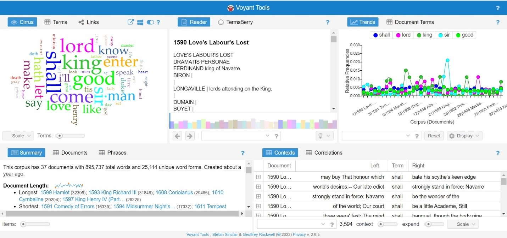

# Making Exercise Eight: Analysis

For this exercise you'll be performing an analysis of text with [Voyant](voyant-tools.org), a web-based digital humanities tool that can work with a wide range of textual data sources directly. After you've found something interesting in the analysis, take your findings into an alternative visualization using any making method that feels appropriate to you -- GIF, comic, illustration, Twine, etc. As you work with Voyant and visualize the results, keep in mind:

- **Explore the possibilities of Voyant itself.** Try the different built-in tools for visualization and textual exploration detailed below and think about this linkage, and particularly how the act of making text visual is in dialogue with our larger conversations around image-text as well as other tools for visualization we’ve considered.

- **Explore meaning at scale.** Working with a small set of texts won’t really allow you to see compelling patterns easily: this type of exploration works best with very large datasets. Look at examples that build across novels, like the compelling work of the [Datasitter’s Club](https://datasittersclub.github.io/site/dsc6.html) visualizing all the *Babysitter’s Club* books across the years 

- **Think about visualization as interpretation** You can work in any materiality or format that makes sense for the visualization, from textile to comic and beyond. Document your visualization through photos, screenshots, or sharing the interactive work as appropriate to the form. It's ok for this visualization to be rough or to use speculative data at this stage.

As with our other exercises, make sure to include both a link to any digital elements as well as documentation of the process and your results from Voyant. For the experimental or material visualization, this might include sketches or iterations of your design.

## Visualizing Text

Voyant offers an ease of use in the browser that makes it fast to get started. Once you’ve loaded the tool itself, there are many options to bring in texts to analyze, including pasting the URL of the text to be analyzed or upload it. Voyant produces word clouds, word frequencies, and more simple visualizations without the need to download any additional software, with the exceptions for websites that aren’t formatted initially in a way that Voyant can “read," which might be better scraped first.

After you upload a corpus to analyze, Voyant displays five panels of information. You will now see a top row consisting of three images: a word cloud under “Cirrus,” a list of phrases under “Reader,” and a chart of relative frequencies under “Trends.” Beneath this, are two additional informational panels: “Summary” which displays the total number of documents, words, and unique word forms in the corpus as well as other length and term metrics; and “Contexts” which displays a column of the most frequent terms (for the Shakespeare corpora, the term displayed initially is “shall”) and three to five words that appear before and after that word within the texts. 

From this starting point, you can further investigate their corpora by selecting other options in the tool. In the word cloud under “Cirrus,” Voyant automatically applies a list of stopwords, or words to exclude from the word cloud, these can be edited by hovering over the blue question mark next to “Links,” and clicking the blue slider symbol. This brings up editing options for the stopwords (words to exclude), white list (words to never exclude), categories, font family, and palette. Clicking “edit list” beside any of these, the user can add or remove from the list. Color palette and font options are of course more limited. The use of stopwords and the ability to edit the list is immensely useful; the researcher can remove obvious key words for a closer inspection of less obvious frequently used words. The way that Voyant seamlessly integrates the editing, as well is much more user-friendly than some other text analysis tools like Orange, which require the user to upload the entire document of stopwords. 

Beside “Cirrus,” you can select “Terms” and see the exact number of times each word appears in a corpus. For the pre-loaded Shakespeare corpus, “shall” appears 3,594 times. Beside “Terms,” clicking “Links” displays a network graph of words that appear near these high-frequency words. Hovering the mouse over the blue key words will show their total frequency in the corpus, but hovering over the orange collocated words shows the number of times they appear near the blue key word, and not the total number of times they appear in the corpus. In the Shakespeare corpus, “shall” is used 3,594 times, and near shall, “come” appears 129 times, “know” 100 times, “make ”107 times, and “sir,” 107 times.   

Beside “Reader” in the next column, the user can select “TermsBerry.” Aptly named, this panel displays high frequency terms in berry-like circles. Hovering over one of the terms highlights that term in green, and highlights other related terms in dark or light red. Selecting “distinct terms” under the drop-down “Strategy” in this panel brings circles of names. “Hovering over “Capulet,” in the Shakespeare corpora highlights that surname in green, and “Romeo” and “Juliet” in light red. 

The “Trends” graph displays the most frequent words in the corpus across its distinct documents, but clicking on a term in the “TermsBerry” panel beside it displays just that term. In the bottom row, beside “Summary,” the user can select “Documents” where metrics for each document are displayed; or “Phrases” which shows multi-word phrases that appear more than once in a document. Phrases can be sorted by frequency or word length of phrases, and in the box beneath the “Contexts” panel, any term can be entered to display the contexts; clicking “Correlations” in that panel allows for text to be entered in the same box to view word correlations. Clicking on the button “scale” at the very bottom of the “Contexts” or “Correlations” panel (after clicking the > button to scroll the bottom menu) allows phrases to be searched by corpus or document.

Once you've used these methods to find something interesting, take just that data to your own visualization: this can be material or digital, but should draw out something compelling from the data that wouldn't otherwise be easy to "see."
