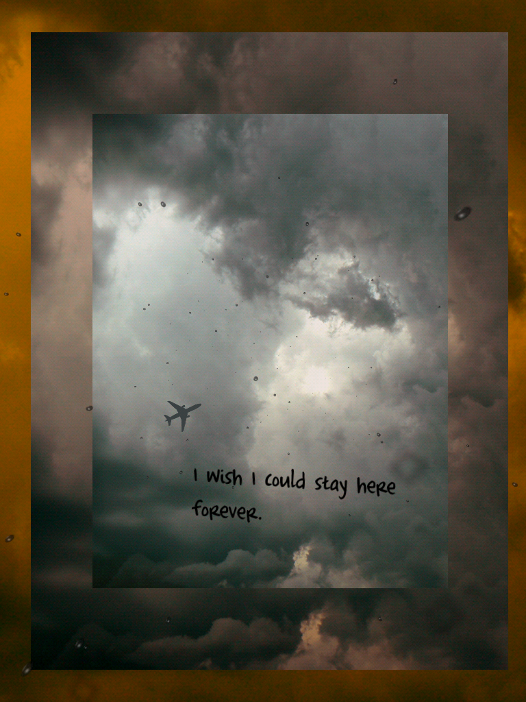

# Making Exercise Eleven: Narrative

As we continue our play with P5.js, I've built a starter project for you to explore epoetry and narrative. Depending on your programming background, feel free to branch out further from the provided frameworks. Keep in mind the inspiration works we discussed, and particularly draw on influences such as [Algorithmic Sea](https://the-color-of-water.github.io/AlgorithmicSea-ObservableArti) and [Strange Rain](https://erikloyer.com/index.php/projects/detail/strange_rain), shown below.

Think of this as a free-form creative exercise. You can focus on aesthetics, poetics, or motion, depending on your interests.

## The Narrative Prompt

As we'll be taking our inspiration from electronic poetry and narratives as a form of making this week, this is a free-form exercise in building your P5.js knowledge while exploring computational creativity. Work between existing code and  I've provided three starters that suggest different possibilities for working with P5.js to allow for moving or interactive text. After watching the video, explore their capabilities, and then think about making your own. There are suggestions in each for ways to push the style, text, and design further. Focus on:

- **Experiment with code and debugging.** Try things, and break it. Consider loading in images, exploring , and think about how you can work from basic shapes and text to leave an impression. Remember, if you break things you can always go back and fork the original code.
  
- **Change aesthetics and poetics.** Play with the text, and think about how you can use text and color to convey emotion. Try building a mood, and consider branching out to draw in images or create a sense of space. We'll cover options for play in the live session, and the comments in the samples give suggestions of simple substitutions to try.

- **Generate your own moving or interactive text.** Using generative AI and building on our efforts last week, craft a new prototype with moving or interactive text. Think about the examples provided, and try to use precise prompting and edit the resulting code to achieve your goals.

As always, include links and screenshots of your forked experiments and the new prototype, including the conversation with generative AI. 

## Walkthrough and Resources

My video for this week walks through the first steps of generating an escape room, inspired by classic Flash games. However, the tutorial stops short of completing the exercise. For an example of a finished version of this, take a look at my [complete generated escape room](https://openprocessing.org/sketch/2223658), which finishes the process with a few additional steps. Here's the overview of the process I followed to complete the prototype:

1. Generate a 600 x 600 pixel art background for an escape room game with a bed, bookshelf, box, and door. (This took several attempts, because it is inclined to try to make this 3D - I ended up giving it an example from an existing game to get this one.)
2. Generate a P5.js script for using this art as a background for an escape room game, defining zones to display text for each area when the player clicks on them. (It will try to recognize the objects in the image it created, but expect the coordinates to be wrong.)
3. Generate the P5.js code for displaying the coordinates while mousing over the image. Use these coordinates to fix the zones it generated originally.
4. Tweak the text display so that it is legible - in this case, I made the text larger and added a stroke outline to better distinguish it from the background.
5. Rewrite the script to include a state change after the player opens the box, tracking posession of a key and making it possible to escape the room by clicking the door.
6. Add a new display to the end of the game, making the screen go black and displaying the "You escaped" text in the center of the screen.
7. Revise the coordinates display to instead show the name of the object when the player is over a clickable area. 
8. Rewrite the end state so that the objects no longer display once the player has escaped.

Testing every step is essential to getting working results, and you'll notice there are several points where I had to modify and play with the results (including manually adjusting the coordinates.) Document your process similarly in your reflection, and try to build iteratively towards a more complex object.

The three traditional samples provided demonstrate different approaches: try each one to understand the possibilities before you start generating your own.

- [Click Poetry](https://openprocessing.org/sketch/1325975) builds on our last mouse interaction piece: click to place a line of text. The work will cycle through a text in order, allowing for a sense of narrative progression or poetry if you write your lines intentionally. The text gradually fades from the screen.
- [Falling Text](https://openprocessing.org/sketch/1325914) uses a simple particle system to create moving text, inspired by *Strange Rain.* Don't worry about changing the code for the particle system itself: you can manipulate the speeds, positions, colors, and text to transform the experience.
- [Moving Click Text](https://openprocessing.org/sketch/1325979) combines elements of the other two examples to create moving text where the user clicks. The lines will become unreadable as they shift across the screen and fade. Again, don't worry about changing the code for the particle system itself.

If you want to explore further, try following the exercises in the [Creative Coding](https://creative-coding.decontextualize.com/) resources.
