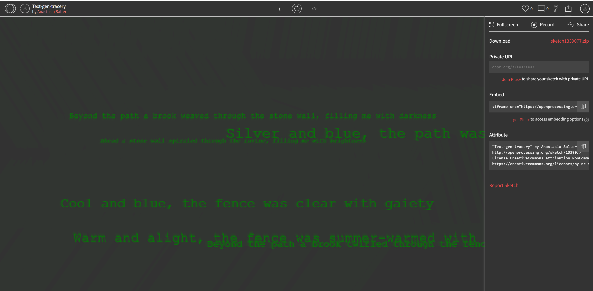

# Exercise Fifteen: Multimodal

As with our meta- assignment, this week's exercise is focused on the remix. There's no need to pick up additional tools, but think about drawing together aspects of your making and conceptual prototypes into the foundation for a larger project. This week's video covers several combinations you can consider, from bringing Timeline.JS and StoryMap into Scalar to integrating P5 with Twine and/or Bitsy. Going back to the basics (such as comics and gifs) can also be a great way to bring together the components of your making for the final exercise.

Often, this will require revisiting the previous modules and looking at additional documentation for exporting and embedding: for instance, the above screenshot shows the export options on OpenProcessing for different ways of working with the P5 sketch outside the platform. Leave time for debugging these combinations, as even HTML and JavaScript files can be difficult to combine without errors.

## The Multimodal Prompt

This week's prompt is intentionally flexible to allow you to choose the tools, platforms, and experiments from our previous weeks that you most want to revisit and expand upon. Here's a broad recipe for your multimodal making:

- **Combine at least three ingredients** - Depending on your interests, these might include more visual, procedural, or data-driven components that work well together. For example, Tracery combines well with P5.js, and both might make a fantastic "prelude" to a Twine piece geared towards the Electronic Literature Organization exhibition call.

- **Convey a coherent theme.** - Approach your multimodal exercise as a coherent whole: rather than showcasing the technologies and making execises from previous iterations as fragmented components, revisit each part and think about how it adds to an overall theme. Revisiting your text will help draw the pieces together.

- **Work towards aesthetic unity.** - Think about ways to connect the components of your work visually: can you revisit font choices? Use a shared color palette? Try to avoid drawing attention to the separate pieces of your work - instead, play with strategies to bring the interfaces, and ideas, together.

## Multimodal Resources

As we're revisiting previous platforms, there are no additional specific resources for this week: we'll cover specific techniques during our optional live session. Try revisiting each of the exercise overviews for the making methods you're combining, and take another look at the additional and advanced resources listed.
