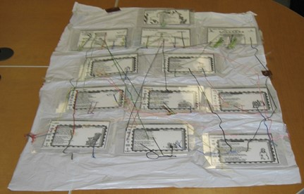
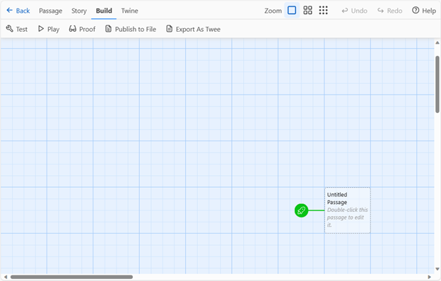
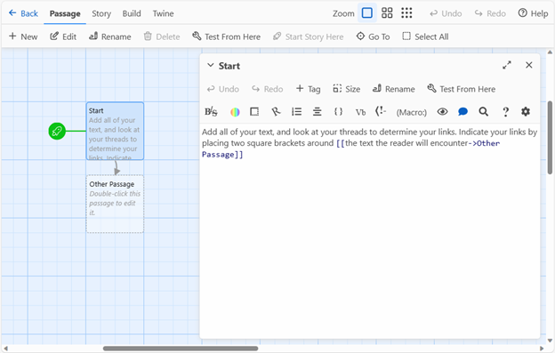

# Making Exercise Five: Hypertext

Hypertext is, fundamentally, linked text: the structure of the link is the most meaningful innovation the web offers us, as it offers both a way of crafting internal structures and external connections that can be immediately realized. You interact with hypertext all the time, primarily through browsers and social media platforms. In this pattern, you’ll be making a hypertext using a free tool, Twine, in two stages: a physical prototype followed by a playable hypertext. You can view the demo from this week's lecture [here](https://amsucf.github.io/Critical-Making-Syllabus/exercises/materials/CriticalMaking.html).

As you work on the physical prototype and the hypertext itself, think about:

- **Focus on compelling choices.** You don’t need to have lots of branches, but a few branches can be a way to dive deeper into an idea or to present contrasting or conflicting views. Instead of giving the user minor decisions, try creating just a few branching paths with significant differences. Jim McGrath et al's [*Insufficient Memories*](https://jimmc-grath.itch.io/insufficient-memories) offers an example of this in action as part of an exhibition on memory and materiality. My collaboration [*Blocked In*](http://hyperrhiz.io/hyperrhiz21/games/5-blocked-in.html) is an example of this approach, as is  Chloe Milligan's [*En(Twine)d with Ergodic Rhetoric*](http://cconlinejournal.org/milligan.html) uses the form to reflect on Twine itself.
- **Connect with your reader.** Twine is often used to create very personal hypertexts that invite readers into the author’s experiences, research, or stories. In this form of writing, it can often make sense to use “I” and “You” to build the hypertext as a conversation between you and the reader. Stuart Moulthrop's [*Dread Box*](https://thedigitalreview.com/issue00/dread-box/begin.html) falls into this category, engaging with 2020 through a poetic lens. Dietrich Squinkifer's [*Impostor Syndrome*](https://games.squinky.me/impostor/) reflects on embodiment in text. Similarly, consider Lee Skallerup Bessette's discussions of representing ADHD in Twine from this week's videos, and Cait S. Kirby's more narrative-driven commentary on COVID-19 re-opening plans, [*September 7, 2020*](https://caitkirby.com/downloads/Fall%202020.html).
- **Experiment with design.** Twine’s editor includes many familiar options for trying out color, font style, and other design elements in the browser. Try using those to vary your passages and add emphasis to different sections of the text. Look across both creative and critical Twine examples for inspiration.

## Stage One: The Physical Prototype

Twine works in links and passages: links provide the navigation, while passages display the text and other elements for the reader to engage. To design your own hypertext using these foundational elements, you’ll need notecards, string, and tape. This method follows the example of Deena Larsen’s shower curtain (pictured above), an artifact now held in the MITH archives. By working with notecards and twine, you can plan out your idea and think about key decision points (the yarn acts the “twine” connecting passages). 

Mark one index card with a star – this will be the first screen your reader sees, so it should introduce the project and provide context for what follows. Links from that passage can move through linear sections (where passages must be seen to continue) or they can start branches (where readers might only see one possible route moving forward). 

Every passage should have a unique title: for simplicity, label your first card “Start.” You’ll use the titles to keep track of the links in your hypertext. Remember you’ll also need a name for your project.

Physically, the use of thread and tape between cards allows for some precision: you should tape your thread to the word, phrase, or choice might lead in one direction versus another. Build your prototype with the goal of having at least one complete path, with a sense of an ending and closure. Remember, all your index cards will need to be connected to something: a passage that doesn’t have a link in Twine will be completely inaccessible to the reader. 

## Stage Two: Hypertext with Twine

Navigate to twinery.org in any computer’s web browser to set up Twine for the first time. If you are using your own computer, you can download and install Twine by selecting “Download Desktop App” on the main menu. However, if you can’t install software on the computer you are using, you can select “Use in your browser.” This pattern assumes you are using the browser version: however, the interface is nearly identical.

Start by selecting “+New” to create a new project, and name it with the name of your project you decided on during the physical prototype. After you’ve typed and confirmed the name, the main editing screen (shown below) will load. Note that Twine isn’t a hosting service, so when you’re working online make sure to select the option to “Publish to file” (under “Build” in the story menu) frequently to save your work. 

There are several advanced options that you can ignore for now, including the choice of story format: stick with the default, Harlowe. Double click on the start passage (marked with the green rocket ship) to add the text of your first index card from the prototype. Select “Rename” to change to the title of your first card (Start) and type the contents of your first index card in the main editing box.

Next, add all the links to your Start passage by putting square brackets around the text you marked with your thread. Follow your threads on the physical prototype to check the names of the passages they linked to. Links will follow the syntax: **[[text to click on->Passage Name]]**

When you use this structure, the links will display the initial phrase (before the ->) and lead to the passage named in the second half of the link (after the ->). This will allow you to have different phrases link the reader to the same passage, as shown in this sample code:

- We might [[say one thing->phrase of significance]] and [[mean another->another passage]] – we can even include multiple links that appear different but lead to the [[same place->another passage]].

The editing interface also includes options to style your text (shown below): these work similarly to any text editor, with options for text styling, colors, and alignment. Try experimenting with those as you add in the rest of your index cards. Every time you add a link to a passage with a title you haven’t created yet, the passage will pop up with that title, as shown.

You can test the essay as you go by selecting “Play” under the Build menu (shown in figure 5.) When the project is complete, you can share it with others by selecting “Publish to File”: this will allow you to save a complete .html file, viewable in any browser. Attach that file to your discussion post to share.

## Additional Twine Resources

If you have experience or want to go beyond this initial tutorial, here's a few starting points to consider. This isn't necessary, but might also provide you with ideas for the future.

- **[*Twining* Tutorials](https://www.fulcrum.org/concern/monographs/ms35tb924).** In *Twining*, we walk through several approaches to Twine in the practical chapters. I would suggest P-4 if you are interested in additional aesthetic elements, and P-2 / P-3 if you are interested in procedural elements and poetics.
- **[The Twine Cookbook](https://twinery.org/cookbook/)** This well-documented project walks through the different Twine story formats and a number of common elements and structures you might attempt to incorporate - this works particularly well for copying and modifying working examples code.
- **[Exemplary Interactive Fiction](https://ifcomp.org/comp/2020)** While I've focused on essays and intentionally scholarly work in my exmaples, there's a lot you can draw on in the approaches of fiction writers. For a starting point, consider exploring the winners of the past Interactive Fiction Competitions.

## Quick Tips

1. Consider hosting your .html file, particularly if you want to include images, GIFs, and other audiovisual components. You can use hosting space you already have, or consider sharing your Twine work on GitHub pages like my demo here. If you haven't used GitHub, don't worry about this option yet - we'll talk about it more later!
2. Remember, if you use the web based version of Twine 2, save your .html file to your computer regularly! This is not an online hosting service, and you won't be able to access your project from a different browser.
3. While there's lots of options out there for greater procedural complexity, don't worry about learning anything complex for this project! Focus on simple, choice-driven representation and exploring an idea to make a compelling argument. You don't need to use any elements that weren't covered in the demo (this week's video), but you are welcome to experiment!
