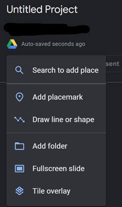

# Exercise Four: Maps

With the mainstream application (and reliance on) GPS technology, most of us already spend a lot of time looking at digital maps. You might even have engaged in some annotation, particularly if you’ve saved favorites or mapped out a road trip in advance. While once GPS devices were reserved for hikers and others engaged in more serious exploration, now we are often carrying multiples on our person—even as I write this, I’m wearing a GPS-capable watch and sitting next to a GPS-capable phone that are broadcasting my location most of the time. You can also imagine other ways to use spatial storytelling by looking at alternative making, such as the explorable XKCD comic [Click and Drag](https://xkcd-map.rent-a-geek.de/#10/1.1000/0.2000).

## The Map Prompt

Since we’re so familiar with this technology, it feels like a more accessible interface for one of our first patterns engaging in the digital: as you explore map-making, the emphasis will not be on coding, although more advanced forms of this work have the potential to delve into more complexity. The coding is nearly all done for the user, behind a what-you-see-is-what-you-get (WYSIWYG) interface. The process of creating a Google Earth Layer is more interface-driven than many of the other patterns in this book; as with all critical making projects, the key here is to create the map around a coherent, informed critique. This pattern is thus an opportunity to think about spatial visualizations using a constrained interface for telling map-driven stories. As you map, think about:

- **Focus on spatial specificity and structure.** Your map will work best with a concrete connection to locations, whether that’s on a smaller scale like Joyce’s Dublin, or a larger scale like a war history visualization. In some cases, you might be mapping the fictional on to the “real” history or the historical onto landscapes that have changed vastly, and that juxtaposition can add to the meaning.
  
- **Try telling a story.** As the examples we’ve discussed thus far highlight, one of the distinctions between a critically-constructed map layer and a more basic information visualization about a location comes through in the intention. The slide-like structures map layering offer are also well-suited to organizing a narrative, and thus conveying an argument.
  
- **Explore image-text possibilities.** Google Earth embeds several options for juxtaposing visuals and texts: think about using those elements not just for description but for communication, persuasion, and critique. As maps are themselves a form of image-text, consider how your layering is in line with comics and other image-texts.

Google Earth layers can be created at [earth.google.com](https://earth.google.com/) using a Google or Gmail account: logging in also stores your project for sharing and changes later, just like other Google services. Start by selecting “new project” and choosing to “create new project in Google Drive.” Once launched, you’ll see options for creating a map layer include adding a new feature from the following options: placemark, a line or shape, folder, a full screen slide, and a title overlay (shown below).

From there, the map can be used to display information about various locations—highlighting the similarities, differences, and more between the various locations, as informed by your research and engagement. However, it works best as a space for commentary and even reflection on the journey you are taking here. Remember, your map must be interactive, and it must contain a critical making statement that calls attention to, questions, critiques, or celebrates some larger aspect of humanity. You might find it helpful to experiment with the options around drawing lines and shapes and adding multimodal content, which are [well-documented in Google's overview of the tool](https://www.google.com/earth/outreach/learn/create-a-map-or-story-in-google-earth-web/).

Expect to be frustrated by some of the limitations of the tool: working within constrained interfaces and platforms can limit our expressive potential, but it also helps guide the making and provides limitations that can prevent the possibility space of the entire world from becoming too overwhelming to proceed. This is a particularly good exercise for narrowing your scope and thinking thoughtful of what is necessary to communicate your intentions—practice that will serve you well in our next pattern, hypertext, which similarly pushes us into path-making that can lead in many directions.
