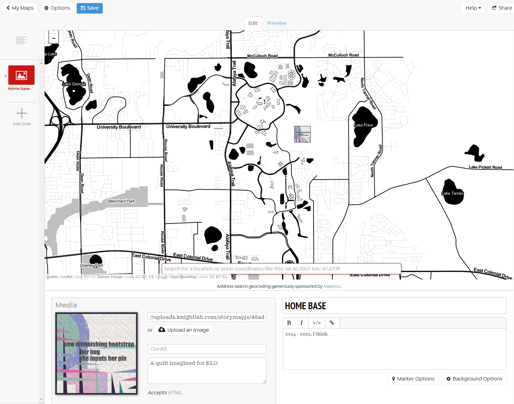

# Exercise Fourteen: Maps

This week's exercise is an opportunity to think about spatial visualizations using a simple, limited interface for telling map-driven stories. It is comprable to more advanced (and expensive) tools popular in public history and digital humanities usage, such as [ArcGIS](https://www.esri.com/en-us/arcgis/products/arcgis-storymaps/overview).

Structurally, StoryMap is very similar to the Timeline tool we used in exercise twelve. However, there are a few important distinctions: geographic locations, rather than dates, govern progression; and the interface is focused on visual entry rather than import through a spreadsheet. For a detailed walkthrough of the platform expanding on the video tutorial included in this week's module, check out the [Digital Humanities Toolkit overview](https://dh.sites.gettysburg.edu/toolkit/tools/storymap-js/). You can also imagine other ways to use spatial storytelling by looking at alternative making, such as the explorable XKCD comic [Click and Drag](https://xkcd-map.rent-a-geek.de/#10/1.1000/0.2000).

## The Maps Prompt

For this exercise, you'll need a concept that is best explored spatially. Think about something where geographic data is available, whether it is distributed on a larger (global) scale or highly localized to a region. You'll want to draw together a mix of found and original images, texts, and media objects associated with this spatial story--metaphors driven by journeys, exploration, or movement over time work particularly well with this platform. As you make, think about:

- **Spatial specificity and structure.** Your map can be driven by real or fictional spaces - for inspiration, check out the Game of Thrones inspired [Arya's Journey](https://storymap.knightlab.com/examples/aryas-journey/) example map. Use the built-in lookup tools to hone in on coordinates and visualize the locations.

- **Multimedia integration and experimentation.** As we look ahead to our final multimodal exercise, think about ways you can embed and build upon the other types of media you've made in this class. Try using a variety through the story.

- **Telling a story.** Use narrative, poetics, or critical discussion to link the nodes of your map, and think about the ways the interface allows you to construct meaningful relationships through both locations and content.

As always, link to your finished storymap with screenshots from your process and iterations within your reflection post, and don't forget to check back to discuss with others doing this bonus exercise.

## Resources for Mapping

For more advanced usages of the tool, and ideas for bringing it into conversation with your other projects, see:

- [StoryMap for Images](https://storymap.knightlab.com/gigapixel/) - This more advanced tutorial covers the integration of zoomable, large-scale images as the center of the spatial story.
- [StoryMap for Technical Users](https://storymap.knightlab.com/advanced/) - If you are frustrated by some of the limitations and defaults in the graphical interface for StoryMap, consider looking at this guide for examples of how to work directly with the code.
- [Scalar Map Embedding Instructions and Example](https://scalartogether.pubpub.org/pub/gh7bzlpp/release/3) - As with Timeline, StoryMap is designed for embedding across platforms: this demonstrates embedding in Scalar.
- [Omeka Storymap](https://github.com/agile-humanities/agile-storymap) - Embedding in Omeka is more complicated: if you're interested in future applications of this time, this repository has resources for making the integration.
