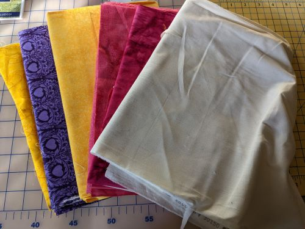

# Making Exercise One: Selfie

Every week, you should plan on first completing the readings and watching the recorded material before diving in to the tutorials. These will provide the framework for the making, as well as examples of what that making might look like from other scholars. 

## The Selfie Prompt

Many of us take selfies all the time: the desire for self-representation is older than our mobile phones. You might even have ventured further into self-portraiture, particularly if you’ve taken art classes along the way on your educational journey. For this pattern, you will start with the digital and use it to fuel your slow making. Start by finding a selfie, or taking a new one, using whatever device you have at hand. Selfies are typically characterized by angles and positioning that indicates the device is being directed by the user: this is an essential part of the process and composition, as it makes the “selfie” a result of your own gaze, amplified by the already-algorithmic lens of most modern cell phone cameras. Note the results of using different settings: many phones have some version of a “Portrait” mode, which will typically blur the background to put the emphasis on the figure, resulting in more dramatic results.

Next, load that selfie into any image-augmenting or filtering software, and save at least ten different iterations exploring different directions. Think of this process as generating a gallery of re-imagined, altered, glitched, and even “beautified” selves, and particularly notice how different types of filters employ standards of thinness, whiteness, or other critical gazes when modifying your image. Be cognizant of the policies of free image modification apps: if your university has a subscription to Creative Cloud, Adobe’s tools are generally safer for use, and offer both conventional (algorithmic) filters as well as augmented (AI) tools for re-imagining the images. Note the distinction between the two: what stands out in each model? In your results? In the remixing and mash-ups as your image moves through the hands of different digital “makers”?

Once you have a result that you find both compelling and simple enough to “make,” think about the relationship of the generated image and the material. Many filters are intended to mimic physicality: you might try using a “cut paper” lens if you want to build your material version in collage, for instance. Don’t get caught up in representational accuracy: think about how the material manipulation requires a different way of thinking, and working, than the rapid process of re-generation digital tools offer. Think about how your process of drawing, making, or transforming the selfie works with and against the algorithmic, and particularly consider the way that the AI filters start to reshape the image at a more fundamental level. As you craft the image, remember to:

- **Explore the relationship between the digital and the material.** What do the different filters make you notice about the image of yourself? How do they distort or exaggerate your features, or perhaps even move the image towards the surreal or unrecognizable? Try a wide range of different options and compare and layer their results to see the most interesting and unexpected emergent changes.
- **Use materials you have on hand.** As you move into making the physical version of the digitally re-imagined selfie, I encourage you to craft your “selfie” using materials and knowledge you already have. Think broadly about what that might look like: anything, from a [Lego mosaic](https://www.brothers-brick.com/2020/07/01/lego-art-revealed-as-mosaics-of-the-beatles-marilyn-monroe-star-wars-sith-and-iron-man-news/) to [macaroni art](https://www.boothbayregister.com/article/memory-bench-proposed-boothbay-harbor-artist/9953) to Sculpey clay that might be on your table, and bring with it a sense of familiarity and return to physical manipulation that for humanities scholars is not necessarily a strong part of our day-to-day practice. The relationship between the self-representation and the material need not be straightforward: consider how you might use your digital or physical material unexpectedly. 
- **Embrace failure and mistakes.** Work to resist the urge to go back, redo, and extend your time beyond these suggested guidelines: this is an ephemeral exercise intended to help us build the mindset for critical making. Digital filters work fast, but the process of slow making can be more frustrating: consider how this material resistance shapes the resulting image, and your relationship to it—a shift from “selfie” back to “self-portrait.”

Your reflection for this prompt should consist of approximately five images documenting your process from concept to final work, with a short narrative accompanying it that walks through your thinking. Make connections to the readings and anything that inspired your work, including both examples from the course materials and your own experience with craft outside of this course.

## My Selfie Sample

*This is provided as an example - it need not be precisely imitated by any means, but I hope it makes concrete what might otherwise seem abstract!*

This week, I took the same prompt as I've given you here, and took it as a challenge to experiment with my own approach to what I'll refer to broadly as [computational craft](https://www.youtube.com/watch?v=mwtKiwQxyKY), or play at the intersection of more traditional craft (in my case, textiles and quilts) and procedural methods. With the short window for this exercise, I knew I didn't have time to both build something generative and make a material object, so I decided to focus on the process of playing with the textiles more than on the procedural side of the "selfie." This is in part a nod to Matt Ratto's observations in this week's readings regarding the "role of investment in connecting lived experience to critical perspectives" (258) - that is, the "time I have wasted" in textiles informs my critical perspectives on texts and technology.

Given that, I set out with a basic plan for my making: first, I would find a way to filter or algorithmically manipulate an image of myself into something that sparked a visual interest or connection. Then, I would rapidly prototype that manipulated image using simple quilting methods. I considered loading up Photoshop, but knew that would likely put me on a path of perfectionism with my search for a meaningful way to manipulate my image: instead, I searched for Android apps with decent ratings for photo manipulation, and ended up downloading one called "Glitch Lab."

- 
- 

There's a lot of options in this that I knew would lead me down a path of tiny pieces and excessive time for this exercise, so I explored the pre-built filters until I found one that offered a distortion that offered a retro feeling that reminded me of the algorithmic distortions of glitch art broadly.

However, I realized as I moved to the next step that I'd set myself a challenge of materiality: the vibrant colors of the unnatural, processed image were poorly matched by my collection of quilting cottons. But rather than backtrack, I decided to embrace the muted palette and acknowledge that the transformation from tech to textile is perhaps appropriately a type of "softening."

- 

Some of these fabrics date back to the 90s: I've been working with textile in one way or another for a long time. My fabric collection is its own archive reflecting back phases of my work in ways that are themselves layered with memory - for instance, one of the purples I pulled is a remnant from a baby quilt patterned off Eric Carle's illustrations. Playing with intertext(ile)uality is inherent in quilting, and something I like to bring to critical making in any medium.

Once I settled on fabric, the next step was cutting. I could achive something more exacting through digital tools - taking that photo manipulation into photoshop, using it as a cutting pattern, and allowing the machine to cut with precision. However, the labor in that would far exceed the time allowed for experimentation, so instead I went with a hasty sketch to guide free-hand cutting of applique shapes. (For the textile-y, I used double-sided fusible interfacing so that I could place the shapes quickly and not worry about carefully sewing everything on.)

- 
- 

I've never quilted a selfie before, and I've been wary of trying to do anything human-looking because the precision is so demanding. But for this, I wanted to play with impressions. Once everything was ironed down, I moved to the sewing machine to add the "quilting"--the lines that hold everything together. For speed, I stuck with a single color of embroidery thread, and thought about using linework to capture impressions (ok, and maybe wrinkles.)

- 

The end result is something not particularly human (the vote in my group chat was "remotely human"), but in the process of blending the procedural artist input of the app's glitched lens with the fiber materiality I see the potential for exploring how we negotiate the tech-text-textile. I could imagine revisiting this as part of thinking through feminist lenses on manipulated photography, which is frequently associated with vanity and performance of artifice. The outcome is perhaps more than a little unrecognizable, but the process demonstrates the filtered gaze of digital and material that is the intention of this pattern.

- 
