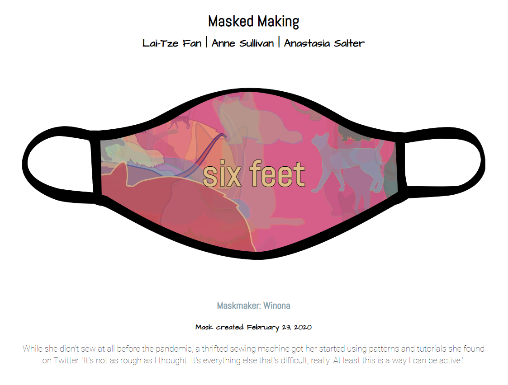

# Making Exercise Seven: Generator

As we look towards the role of computational tools in making things visible and in_visible, we are going to gradually expand our procedural literacy. So far, we've focused on adding dynamic elements (looping, choice, and interactions) to our making: this week, we will concentrate on the *variable* using [Tracery](https://tracery.io/), a grammar for procedural text generation created by Kate Compton.

A few of you will have encountered Tracery before: if you have, I encourage you to try one of the suggestions for adding on to the basic assignment. Note that this exercise asks you to respond specifically to the themes in the closing of our readings, and thus should require a very different type of grammar than you've made before if you used Tracery in the context of the Theory course.

## The Generator Prompt

For this exercise, you will make and unleash a Tracery generator that responds to the provocations of *Your Computer is On Fire.* Your grammar should engage, either metaphorically or literally, with how your own research is shaped by the current "fires." Consider the examples of generative texts that demonstrate this type of engagement, from Mark Sample's [Infinite Catalog...](https://fugitivetexts.net/pandemicdreams/) to Clare Hooper's 2020 NaNoGenMo piece [Data of Death](https://github.com/NaNoGenMo/2020/issues/79). Your generator should:

- **Demonstrate a thoughtful range of grammar.** Try building on the model in the example first if you are new to generators, and incorporate a vocabulary appropriate to the type of making that drives your work. This is a great opportunity to play with language and consider the intersections of poetics, pragmatics, procedures, and play.

- **Expand upon at least three different rules.** Generate a dynamic range of content by employing multiple sentences, patterns, or syntax structures. Think about how you might invite someone to engage repeatedly with your grammar by crafting a meaningful generator of variety.

- **Be engageable in a space and context.** Either launch your grammar to Twitter as in the example (the simplest solution), or consider integrating it into a Twine or Bitsy experiment as described below. You can also embed it into a .html file, as in my [retro-generative collaboration with Anne Sullivan](https://dalamar.neocities.org/) or [Masked Making](http://www.asdesigned.com/maskedmaking/).

As with our other exercises, make sure to include both a link to the generator (in whatever context you have deployed it, from Twitter bot to website to game) and your process reflection, drawing on the connections to our readings and considering the relationship your work has to a world of algorithmic content.

## Working with Tracery

Tracery can be used for both visual and textual play, as demonstrated in the [Masked Making](http://www.asdesigned.com/maskedmaking/) generator, which uses both a textual grammar to create the imagined names of masked makers and their stories as well as a visual component to craft the masks themselves:

This is great practice for thinking about procedural generation and the construction of digital art, as well as the constructed nature of many web texts that invade our feeds and platforms.

Follow our two-stage tutorial to first generate a simple grammar, then embed it into a Twitter bot. Once you have the foundation working, consider working through the resources below for more playful making options.

## Resources for Experimenting

There are several paths for those with more experience, or for your future play in Tracery. Here's a few general resources on Tracery grammars and adding fun elements, such as emojis:

- [Tracery Live Demo - Adding emoji and dynamic elements](https://gregoryaveryweir.github.io/tracery-live/) 
- [Tracery Continued - Adding action rules](https://catn.decontextualize.com/public/notebooks/propp-inspired-tracery.html) 

One great option is to think about incorporating images - or even making memes or comics, as in our previous experiments:

- [Generating SVGs explained](https://github.com/derekahmedzai/cheapbotsdonequick/blob/master/svg-tracery-image-bots.md)
- [An example graphic bot](https://cheapbotsdonequick.com/source/hashfacade)
- [A poetic example](https://cheapbotsdonequick.com/source/5x5poems)
- [A reflection on  bot process](https://harrygiles.org/2016/11/15/nabomamo-the-first-15-bots/)

Another fun option is to continue our exploration of remix by trying out Tracery with either Twine or Bitsy: you can find a Tracery integration in the Bitsy Hacks, and an [example walkthrough here](https://cephalopodunk.itch.io/silence-would-be-better/devlog/1802/bitsy-and-tracery-sitting-in-a-tree). For Twine and Tracery, take a look at our example in [P-4 of Twining.](https://www.fulcrum.org/concern/monographs/ms35tb924), which includes an example with Tracery already integrated into the Twine structure.
