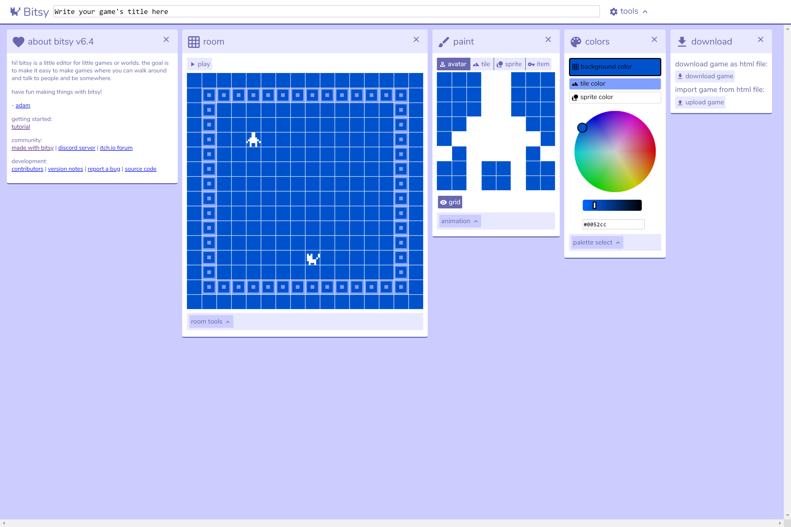

# Making Exercise Five: Games

This week, we'll be working with Bitsy, the tool you'll be using to develop your essay game. Bitsy is a surprising combination of simple and powerful: it embodies the playful practices of "creativity under constraints" we've started exploring through these time-limited, occasionally Dada-ist exercises this semester. At times you might find its limitations frustrating, but these constraints can also help you stick to the available time and keep your scope manageable.

When creating a game as a critical making project at any level in any platform, it is best to first play several games created with the same platform to understand its affordances and to see how other designers have used different features. Next, it is helpful to focus on two elements of the desired game: 1) the topic to be critiqued, interrogated, or highlighted, and 2) the feeling, experience, or knowledge the designer wants the player to glean from the game. Player-centered game design guidelines advocate focusing early in the design process on the motivation behind the gameplay: why would someone play this? What experience, feeling, or knowledge do you want the player to take away from the game? These two aspects of the game will drive the rest of the design. For insights into the process of working with Bitsy specifically towards scholarly output, read [Pippin Barr's account of building an "Ancient Greek Punishment" game in Bitsy](https://www.gamedeveloper.com/design/bits-and-pieces-of-suffering-creating-ancient-greek-punishments-in-bitsy). This includes a breakdown of aesthetic challenges and opportunities, as well as sample code that will help you work on your own project.

The most important rule to keep in mind when working with Bitsy is "think small." As bee ulrich describes in [their article](https://medium.com/@cavegift/https-medium-com-cavegift-bitsy-is-a-tiny-toolset-4016814c5367) on the platform:

> *Where Odyssey feels like a tome, Bitsy games are poems. They’re handcrafted spaces with so little headroom that every last pixel is placed with purpose. Some do it so well they trick you into thinking you’re wandering a 3D dungeon, or cycling a radio through all the bad stations, or flipping through an informative textbook on moths.*
 
Here’s a few things to think about as you design your "poem":

- **Craft a meaningful environment.** As you work on this part of the project, remember to think about how you will operate within the constraints of a limited color palette and pixel grid. You'll by necessity need to scale back your thinking and focus on the essentials - consider how your colors will shape the mood; how choices in details will differentiate one character or object from another; and how your world will fit together as the player moves from "room" to "room." You might find [pixsy](https://ruin.itch.io/pixsy), a conversion tool for making rooms from photos, helpful in crafting evocative spaces.

- **Use dialog to share your argument.** As you think about "dialog," remember that this can be text that is reflective, poetic, or internal - it doesn't have to mean conversations with other characters in the traditional sense. Think about our conversation on platforms when scoping the pace and length of your dialogue segments, and consider that you can also draw inspiration from other hypertextual essays, small-scale games, comics, and the work of the "internet vernacular."

- **Build for interaction.** Think about the "collision" as a mechanism for revealing and understanding the environment, and use the range of sprites, tiles, and items to make the most of interactivity as a way of working through an argument. Take time to explore the essay examples and other works from our readings, and consider how they ask you to engage as a reader-player with the argument.

## Stage One: Storyboarding

Storyboarding can take different forms, but it serves as an outline that helps the designer to plan the beginning, middle, and end of the narrative, which can assist in the more coherent flow of events within the game. If the game is to take a nonlinear timeline, it is even more important. To avoid plot holes and confusion while designing the game, a linear timeline should be developed as a reference, to ensure narrative continuity (unless of course narrative incongruity is the target). Bitsy organizes game design into different rooms which are connected by squares that act as doors to other rooms. The requirement for this exercise in Bitsy is at least three rooms: you can think of each room as providing the scene dedicated to your game’s beginning, middle, and end. 

Next, consider the actions that the player will do within the game. Each square within the game grid can be customized to 1) permit the player to pass through it, 2) block the player from passing, or 3) display dialogue, creating the sense that the player is interacting with the figure in that space. This provides opportunities for the game’s design to take the shape of a maze or dungeon crawler, an open world exploration game, a puzzle game, an escape room, and more. The limited scope of each room requires you to purposefully consider the intent of each square in the grid. Along with this, plan for the visual perspective your game will take. Bitsy’s two-dimensional graphical features can create a game with a top-down perspective, as seen in “The World Has Been Sad Since Tuesday” and “A Prison Strike,” but games such as “Endless Scrolling” use more of an over-the-shoulder perspective where the player seems to be looking over the shoulder of the avatar.

## Stage Two: Bitsy

You'll notice that Bitsy particularly resonates with some of the more current examples in our discussions and readings, despite its throwback - retro pixel art aesthetics. Also importantly for our purposes given the change to our course modality, the [editor for Bitsy](http://bitsy.org) is online and free.  Below is a screenshot of what you will be seeing as you get started: particularly note the "download" tools. Whenever you are using an online editor, you will want to immediately get in the habit of downloading the game as a .html file regularly to save your work. You can then import to continue.

Upon making the selection to create a new game in the platform (by clicking on the cat icon on the homepage), you will see a screen containing five sections, from left to right: 
- About: contains the same mission statement for the platform as well as helpful documentation for getting started with the platform
- Room: displays a 16 by 16 square that contains a human-shaped avatar and a cat-shaped sprite, along with buttons for selecting: edit, colors, tune, avatar, paint, pick, exits & endings, show/hide grid and show/hide walls
- Paint: an 8 by 8 grid where the designer can create avatars, sprites, tiles, and items 
- Colors: contains a color wheel and a place to enter a hex color code for the background color, tile color, and sprite color
- Download: allows the game designer to download the game as a sharable HTML file, as well as an option to import an existing game from an HTML file to edit in the space

The layout of Bitsy consists of a series of different sections that modify different aspects of the game, and the creator is not limited to these five items. When you are working on an aspect of the game that necessitates additional creative input, another section appears on the screen. For example, when a game creating edit and entry locations for a room in the game, as sixth editing field appears, allowing you to create and edit locations and transitions for room navigation.   

Review the class tutorial video and the guidance in the chapter to build a three-room game essay, focusing on scene design, object interaction, character and object design, and dialogue and sound. If you want to go further with a particular element of Bitsy, consider using this [tutorial video series](https://videlais.com/bitsy-tutorials/), which cover animation and conditional dialog in more detail than the class video.

## Tips and Tricks

- For your process post, consider using the "Record Gif" tool in the interface to share elements you are particularly proud of, or to record iterations of your work as you move through your design process. This is a great way to capture the early stages of your game!

- If you have more experience and are feeling limited by Bitsy, you can take a look at [Borksy](https://ayolland.itch.io/borksy) to expand your options. This is a set of "hacks," or prewritten scripts not unlike the ones we used for macros in Twine. Some of the options you might find particularly useful include dialog choices, a mult-sprite avatar, and character portraits.

- Consider [hosting your work on itch.io.](https://itch.io/docs/creators/html5) This is a great solution for making it easily shareable and playable by others, both in the class and outside of it - if you do post your essay, consider sharing it on Bluesky, and tag me if you'd like me to amplify it to others exploring critical making.
