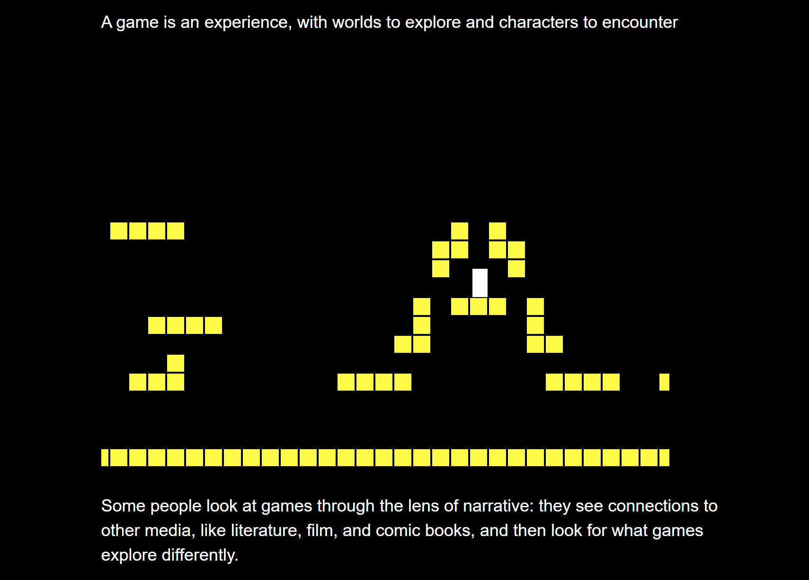

# Making Exercise Six: Metagames

As we've only begun to explore the two platforms introduced in week four and five, this week offers an opportunity to intentionally reflect on their juxtapositions and points of departure. Consider my collaboration in the examples from Buzzademia, "[Blocked In](http://hyperrhiz.io/hyperrhiz21/games/5-blocked-in.html)," which doesn't use Bitsy, but does remix the platformer and the hypertext.

Here's a few playful examples of works that similarly collide mechanics, and rethink the expected limitations of play:

- [On Formalism (Darius Kazemi)](http://tinysubversions.com/game/formalism/)
- [World of Bitsy](https://candle.itch.io/world-of-bitsy)
- [Duplicate & Mutate: Twine](https://dr-d-king.itch.io/duplicate-mutate-twine-2021)
- [Duplicate & Mutate: Bitsy](https://dr-d-king.itch.io/duplicate-mutate-bitsy-2021)
- [Content Moderator Sim](https://samplereality.itch.io/content-moderator-sim)
- [Project Trail](https://projects.cah.ucf.edu/mediaartsexhibits/ClimatesOfChange/Boyd/boyd.html)
- [Under a Caustic Show I Danced](https://communistsister.itch.io/under-a-caustic-snow-i-danced)
- [Wake Word](https://adirobertson.itch.io/wake-word)
- [Unmaking, Unmade](https://gcbaccaris.itch.io/unmade)

## The Metagame Prompt

For this exercise, you have substantial flexibility in form, but a focused goal in concept. This making exercise should have a clear meta component, and provide an interaction that itself reflects on the platform, the technologies involved, the modality of play, and/or the experience of player traversal. Keep the following goals in mind as you make:

- **Craft a new experience.** This should not be a simple redesign of one of your previous exercises, but a thoughtful revisitation reflecting a substantial attempt to change the type of engagement possible (some thematic, content, and structural overlaps are fine, but this should clearly provide something different and reflect an extension of the skills used to build.)

- **Mix and remix modalities.** The references in the tutorial and below focus on adding movement/animation, visual styling, audio, and other elements on top of the initial capabilities of each platform - or for a full remix, try combining the Twine and Bitsy engines together.

- **Break and confront expectations.** Consider how Darius Kazemi's "On Formalism," linked above, uses the motion of a shooter to literally deconstruct the argument presented in text. Consider how interface changes such as making a Twine with no text, only linked animated pixel art, or a Bitsy where every icon and setting is text, might disrupt expectations. Experiment and play with what is possible!

As always, your post should include both the playable work and the reflection, and consider embedding screenshots (or gifs, and noted below) of your process towards the final.

## Resources for Metagaming

In this week's video tutorial, I offer one model for how to approach this exercise: your approach can look very different, or you can riff on the examples provided. Here's the links to tools to support your process - use as few or as many as make sense for your concept:

- [Bitsy Hacks](https://github.com/seleb/bitsy-hacks) - This is one of the best resources for extending and transforming your game experience. Note the included examples for audio, dynamic backgrounds, corruption, and Twine integration.
- [The Twine Grimoire](https://gcbaccaris.itch.io/grimoire-two) - Great resource for increasing the visual design range of your Twine work. (Volume one is simpler, Volume Two includes more dynamic examples.)
- [Twine Harlowe 3 Series](https://www.youtube.com/watch?v=l3zGvR4S27c&t=4s) - For procedural enhancement, coonsider working with variables and dynamic changes in Twine. Dan Cox's video series is agreat place to start.
