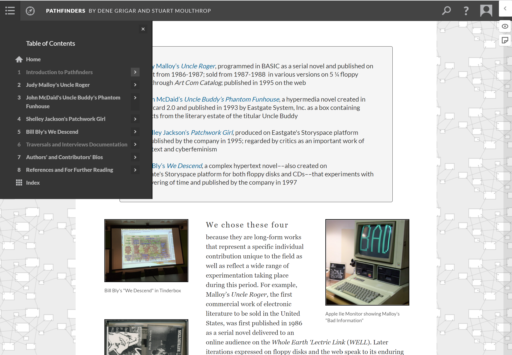

# Making Exercise Ten: Exhibition

This week, we'll be exploring [Scalar](https://scalar.usc.edu/works/), an interface-driven platform for building articles, books, exhibitions, and similar interactive scholarship. Like Omeka, this is a tool that can support very ambitious and vast work, so we'll only be using some of its capabilities: don't worry about trying everything. If you have experience with other content management systems such as WordPress, you should find some of the interface elements generally familiar.

You'll need to get started by creating an account and following the tutorial to create a new project. Try using the built-in import features, and keep in mind how examples like [Pathfinders](https://scalar.usc.edu/works/pathfinders/index), shown above, make use of the page structures and rich media features to build the layers of the experience.

However, don't feel confined in that type of formality - also recall the aesthetics and Twine-esque, hypertextual playfulness of [Redshift & Portalmetal](https://michacardenas.sites.ucsc.edu/redshift-and-portalmetal/), and consider how you can push at the expectations of the platforms as micha cárdenas models.

## The Exhibition Prompt

As with Omeka, our focus this week will be on curating and representing relationships between existing materials. However, for this project you won't need to build the archive - instead, you can pull content from any of the affiliated archives built into Scalar, or from other sources relevant to your work. Curate an exhibition of inspiration correlated with your making: this might include linking games and multimedia projects from the [Internet Archive](https://archive.org/); citing scholarship, novels or poetry; and pulling digitized artwork from the collections.

Your preliminary Scalar exhibition should include:

- **A visual or conceptual theme.** Try to center your content gathering, annotation, and commentary on a theme relevant to how your work is evolving. This is a good point in the course to be looking forward: where is your work going, and what do you want to be in conversation with?

- **At least five short pages, with linked navigation.** Try using the page editor to explore different formats and options, and experiment with different types of navigation to create paths for the reader.

- **Embedded multimedia, including photos, audio, and video as appropriate.** Include at least five imported materials, drawn from the affiliated archives or from external sources as appropriate to your theme.

You might also find it helpful to explore the visualization options, and add them to your exhibition.

## Resources

As Scalar is a well-documented, open source project, there are lots of resources for approaching this exercise:

- The [Scalar 2 User's Guide](https://scalar.usc.edu/works/guide2/index) is usually my first stop, and one of the most comprephensive resources for working with the Scalar interface and import options.
- [Scalar: An Introduction](https://guides.library.illinois.edu/scalar) is a set of resources and overview of options curated by Illinois library.
- [Scalar Video Tutorial](https://www.youtube.com/watch?v=Ie1ioL8BWOQ) offers a longer introduction to the interface, with examples from larger projects in progress.

Remember, you don't need to worry about the advanced plug-ins at this stage. However, know that the HTML structures underlying Scalar allow you to bring in other JavaScript (like our P5 experimentations!) in the future. There are lots of strategies for embedding material, but the simplest is to use [iframe tags](https://scalar.usc.edu/works/guide2/how-to-embed) (just like I use to embed our GitHub tutorial pages into Webcourses) to grab material hosted elsewhere.

Also, for those of you taking Design & Dev (or who have studied Python in the past), you might find this example of [connecting Scalar and networked visualizations in Python](https://zoews.github.io/articles/2018-08/custom-scalar-pt1) useful for future reference.
