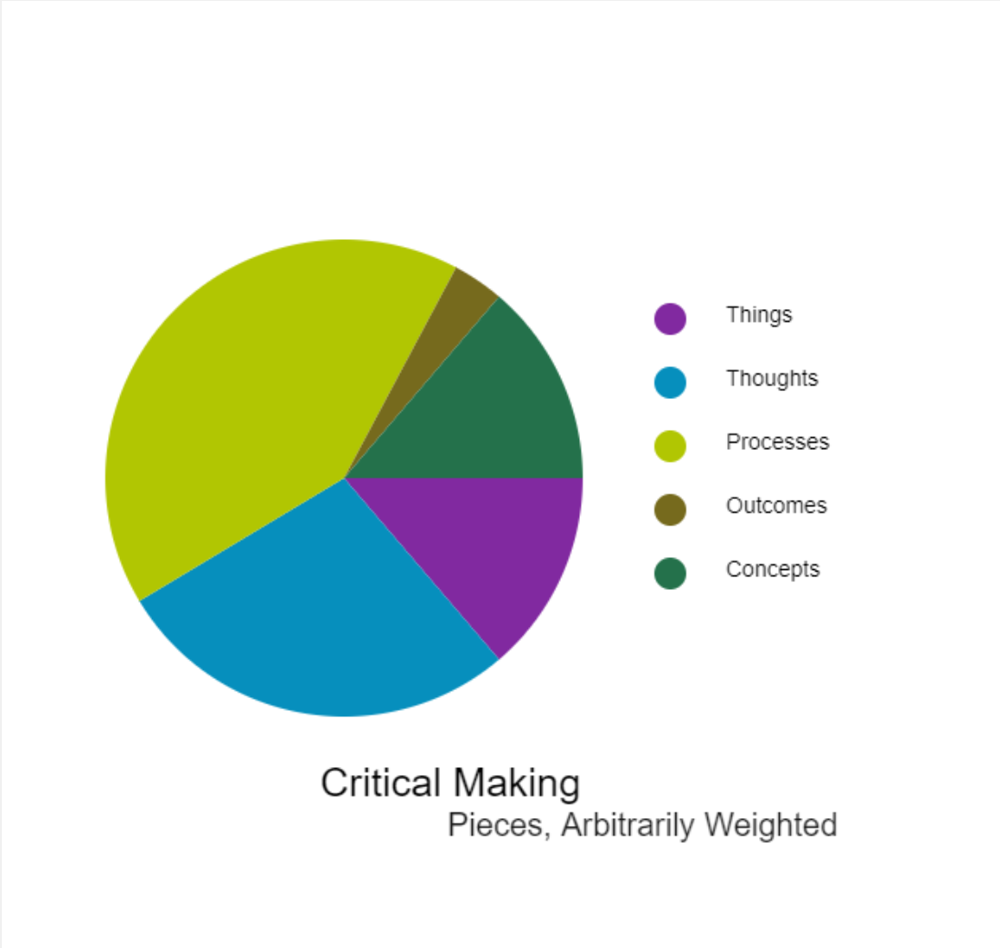

# Making Exercise Ten: Visualization

This week, we'll be taking our first steps with [P5.js](https://p5js.org/), a library that allows for visualization, animation, and interaction on the web. (Note the change from the original listing: to reduce some of the procedural complexity and syntax challenges, we'll be using this library twice and iterating on our work - so don't worry if you are doing very, very basic things this week, you'll get to go a bit further later!) The goal is to understand the act of data visualization through playing with how we visualize data - first with P5, and then with any materiality of your choice.

## The Visualization Prompt

This week's exercise serves two goals: we'll begin exploring the act of visualization, and expanding your procedural vocabulary and comfort with creative coding. This can be a slower process than some of our other types of making, but the tools you gain can be incorporated into our other platforms for multimodal work and experimentation. To allow for both this procedural growth and a meaningful reflection on visualization, you will be creating two ways: first with P5.js, and then in any visualization modality you would like to try aided by generative AI (inspired by the work in [Kairos](https://kairos.technorhetoric.net/25.1/), but not limited to it!)

- **Change and play with the provided P5 structures.** Take screenshots or share links to your forked versions of the provided samples, noting how the limitations and structures of each design influenced what you chose to visualize. You can work from "real" or "conceptual" data here, as discussed in this week's live session and videos.

- **Conceptualize a larger visualization concept.** Drawing on the expressive examples in the reading and your own work thus far, consider something in your work that would be well-served by visualization. In your reflection, note the challenges this visualization might present, considering particularly your audience and how you might approach this communication as a designer informed by the principles in our readings.

- **Explore an AI generated alternative visualization.** Using the same methods we tried last week in generation, and the models I've given you, work with an AI tool to design another type of generation. Remember to specify to the generative Ai that you are using P5.js, and work to be as clear as possible on the goals of your visualization and data.

As with our other exercises, make sure to include both a link to any digital elements as well as documentation of the process, including the conversation with generative AI.

## Walkthrough and Resources

The three samples are shared using [Open Processing](https://openprocessing.org/). This platform is free and lets us eliminate certain steps (like uploading to a web server or configuring the file system) so we can focus on playing with the library itself. Start by creating a free account, then navigate to the samples covered in the video and fork each in turn to make your own iterations:

- [Simple Bar Chart](https://openprocessing.org/sketch/1307584)
- [Pie Chart](https://openprocessing.org/sketch/1307661)
- [Text Click](https://openprocessing.org/sketch/1307624)

In addition to the provided P5 materials, you might find it helpful to explore examples of data visualization broadly. Here are a few sources to start with:

- [Information visualization examples](https://visme.co/blog/best-data-visualizations/)
- [Walkthrough of complex P5 visualization](https://orbit.love/blog/visualize-orbit-levels-with-javascript-and-p5-js)
- [Creative Coding with P5](https://creative-coding.decontextualize.com/first-steps/)
- [Tableau Viz of the Day](https://public.tableau.com/app/discover/viz-of-the-day)

Remember that each stage of this exercise serves a different purpose: if you've never worked with a library like P5.js before, don't expect to realize the type of concept that you might be able to explore in another materiality. Focus on getting comfortable with the basic tools (forking and editing the code's data, color, and string inputs), then use your design exercises to conceptualize where you would like to take visualization as a form of making in the future.
