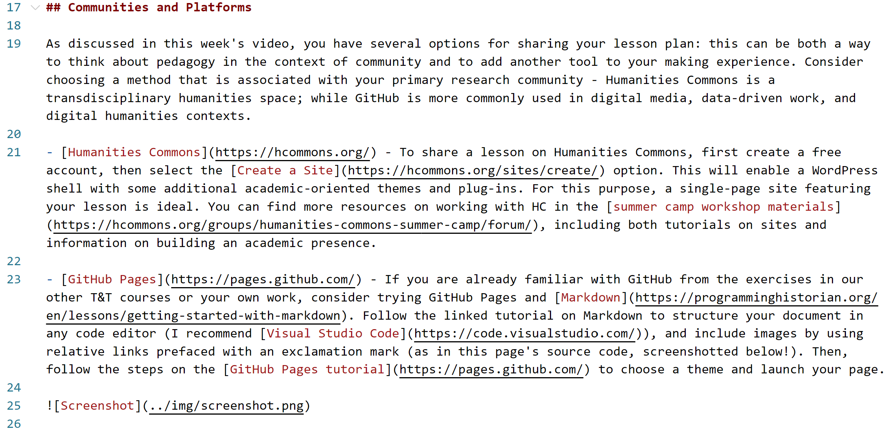

# Exercise Thirteen: Lesson

Now that we are nearing the end of the semester and looking ahead towards future applications of our experiments, we'll be engaging in a different type of "making": designing a lesson plan. This week, you will be crafting a lesson of your own design that intentionally combines theory, practice, and reflection on process (or, as I've set it up throughout our semester, think/make/reflect). Choose any combination of the tools and types of making we've worked with, and feel free to add your own or remix: the focus is not on the tool-technology, but on the act of critical making, and the use of pedagogy to create a space for others to critique, reflect, and engage technology differently.

## The Lesson Prompt

In this exercise, you will be revisiting a making practice and envisioning sharing it with future students or peers in an educational context. Build a single lesson to guide students through the process of critical making: consider readings, context, and structure. Consider drawing on the models in examples like the [Digital Pedagogy](https://digitalpedagogy.hcommons.org/) collection we examined this week on Humanities Commons, as well as playful structures like that of [The DataSitters Club](https://datasittersclub.github.io/site/) discussed in this week's interviews. As you write, include:

- **Theory / Theoretical Context** - Consider providing a brief introduction setting the stage for the inquiry, with references to any recommend readings (these can draw on this course, or other influences from your own work.) Remember our focus is on process and inquiry, not just the transference of technical skills: the theoretical framework should guide that inquiry and set the stage for students to explore their own questions.

- **Practice / Making Guidelines** - Using a mix of your own words and links to appropriate resources (such as video tutorials or examples), include enough guidance to bring someone else to a level of comfort with the tools or platforms emphasized. Consider breaking down a list of resources, or providing a short overview of steps with examples to inspire playful engagement. Screenshots can be particularly helpful for making an example concrete, and additional modalities (like animated gifs) can add inspiration and detail.

- **Space for Reflection** - As with our own work, consider how you will guide students to embrace the process, leaving room for failure and frustration that can in turn fuel reflection and growth. How might students come to their own conclusions abut the values of these tools and platforms, and take them forward into their future work? This is an opportunity for meta critique.

Note that our two examples above (Digital Pedagogy and DataSitters) use the two recommended platforms for sharing your lesson plan, Humanities Commons and GitHub Pages, respectively. Your post should include a link to your lesson with its embedded multimedia, and a brief reflection on your own process of designing the lesson and its visual communication structure.

## Communities and Platforms

As discussed in this week's video, you have several options for sharing your lesson plan: this can be both a way to think about pedagogy in the context of community and to add another tool to your making experience. Consider choosing a method that is associated with your primary research community - Humanities Commons is a transdisciplinary humanities space; while GitHub is more commonly used in digital media, data-driven work, and digital humanities contexts.

- [Humanities Commons](https://hcommons.org/) - To share a lesson on Humanities Commons, first create a free account, then select the [Create a Site](https://hcommons.org/sites/create/) option. This will enable a WordPress shell with some additional academic-oriented themes and plug-ins. For this purpose, a single-page site featuring your lesson is ideal. You can find more resources on working with HC in the [summer camp workshop materials](https://hcommons.org/groups/humanities-commons-summer-camp/forum/), including both tutorials on sites and information on building an academic presence.

- [GitHub Pages](https://pages.github.com/) - If you are already familiar with GitHub from the exercises in our other T&T courses or your own work, consider trying GitHub Pages and [Markdown](https://programminghistorian.org/en/lessons/getting-started-with-markdown). Follow the linked tutorial on Markdown to structure your document in any code editor (I recommend [Visual Studio Code](https://code.visualstudio.com/)), and include images by using relative links prefaced with an exclamation mark (as in this page's source code, screenshotted below!). Then, follow the steps on the [GitHub Pages tutorial](https://pages.github.com/) to choose a theme and launch your page.

Alternatively, you can use your own hosting or a preferred platform from our previous methods to create your lesson: for instance, I've previously built Twine workshop materials and lesson plans using Twine itself, as that allows the source code to become part of the lesson. Select an approach that feels best for you and your goals.
