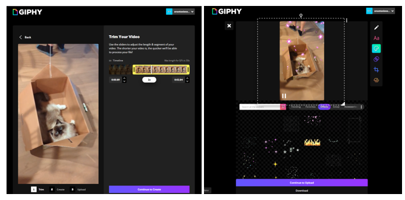

# Making Exercise Three: GIFs

The range of tools with which we might approach the making of moving images for scholarly communication is far too vast to cover here, and continually changing. We have instead selected two options, one image-driven and one video-driven, for exploring the GIF specifically (and animation more broadly) as a tool for scholarly discourse and communication. By making GIFs and experiencing some of the amateur toolsets for that making, we aim first to build our understanding of the GIF, and its potential for misinformation and misinterpretation, as a constructed and manipulable form, subject to rewriting and remixing like any digital form. Next, we can explore the possibilities of the GIF and animation as an archive, considering their potential for low-investment documentation of interfaces, interactions, and ephemeral works. Finally, we should look to interrogate our cultural usage of GIFs as demanding of increased visual literacy and engagement with image-texts outside of the disciplines traditionally invested in this work.

## The GIF Prompt

Drawing on the introductory provocations in *Your Computer is On Fire*, we'll be playing with the internet vernacular modeled in *Buzzademia* as a way to think through our relationship with making in public, and making for the web more broadly. One of the largest platforms for GIF sharing, [GIPHY](https://giphy.com/create/gifmaker), also offers free tools for GIF making. These tools are, unlike some of the other methods we’ll use, embedded in a sea of internet ugly (thanks to the ecosystem of many, many GIFs) and thus also offers a living archive to explore the same content it produces. Accounts are free, and give you access to explore the contents and take inspiration from other GIF makers. Here are a few things to keep in mind when exploring this form:

- **Explore Rapid Prototyping.** A GIF’s limited looping structure and smaller scale make it an object better suited for rapid thoughts and quick impact than detail and nuance. This is a “fast” form for internet communication - most of the work goes into shaping your source material and coming up with ideas on what to make. Try iterating and refining to make the most of this low-investment form, and use lots of different materials (your own and ones you’ve found in the archives) to get the most out of the modality.

- **Place your GIFs in Conversation** Many of the “GIF essay” approaches discussed above treat GIFs as beats in a sequence: this larger pattern of motion brings GIFs into an image-text mode of composition. Thinking through your GIF as part of the web can also be a method for exploring and communicating your relationship with it as a technology as we play with two fundamental procedural elements: loops and motion.

- **Focus on Aesthetic Impact.** Just like with every skill we’re experimenting with, there’s a lot to learn when taking video or arranging still photos. Play with your camera orientation; closeness to the object; framing; and choice of subject. Think about how you will be isolating the moment: you don’t need more than a few seconds of video for an effective loop.

The most flexible way to make GIFs is with Adobe Photoshop, or other high-cost image editing software. Those tools are also overwhelming and support a much broader range of purposes, so we don’t recommend using them for this pattern. If you have used a tool of that kind, you’ll immediately find GIPHY is not as aesthetically flexible. However, what GIPHY does provide a fast way to go from your video fragments to the styling of the internet vernacular, with options for meme styling, text design, and filtering—and the limitations help contextualize some of the sameness you might have experienced in amateur web content.

We will make GIFs from video clips: this process can be done with both your own video, and video from other sources. First, try working from your own video clips, which can be a strong method to explore the making components of GIFs through first exploring physical materiality and movement, then digitizing and fragmenting the results. For this type of GIF, you’ll need low-resolution video: your phone camera or laptop’s built-in webcam are all you need. If you’re comfortable in front of the camera, you might try starring and placing your own “scholarly avatar” at the forefront, as Casey Fiesler does in her academic TikToks—another platform where scholarship is put in motion (Fiesler). If you’re less thrilled about that, consider objects, pets, places, and moments (the passing of a storm, perhaps) that resonate. 
Once you have filmed your source material, the GIPHY editing process consists of two stages: first, crop your clip down to a short timeline that feels appropriate for a loop, as shown in the editing interface in figure 2. Loops are a fundamental structure of the web - recall their importance to the experience of GIFs in motion – and are what make GIFs distinctive for their endless repetition and the motion that draws your attention when scrolling a feed. Pragmatically, loops reduce the amount of data required to provide content, and thus allow GIFs to function as shorthand. Usually, this will be shorter than the original clip.
   
- 

Finish your video to GIF conversion with filters, drawings, stickers, or texts as shown in the options in figure two think about layering the different options GIPHY provides and experimenting with combinations. Most tools are drag and drop, with different options available by right-clicking. The “layers” tool at the bottom offers additional control of every element you add. Notice the role of collaboration in many of these tools: the “Stickers” option shown in figure two allows for the selection of both pre-built and user-contributed moving images, emojis, and special effects, like the falling pixel petals shown in the example above. These options are continually changing, and often reflect trends in online design or memes for reactions that can be layered upon your design to put it in conversation with the rest of the Internet.

It's also possible to make a GIF from a still image: to start this type of GIF, return to the main menu and upload an image instead of a video. The editor will warn you that this initial input isn’t in motion and will provide lots of options for adding that motion, using the same interface as the video options shown in figure two. Filters are particularly effective on still images: these are designed to offer artificial materiality to the image, and often recreate historic media perceptions through options like a slightly blurred, line-filled “VHS” option. There are many ways to develop such stills with a sense of movement to come: you might take photos of elements arranged using material objects (fabric, paper shapes, clay, LEGO figures) or you can turn to photography, drawings, and screenshots. Large files will often not be accepted: think about the GIFs you’ve seen and consider imitating the scale for best results. The better composed your source material (in composition, thoughtfulness, timing, etc.) for each GIF as well as for the fully "essay", the more compelling the final output will be. 
