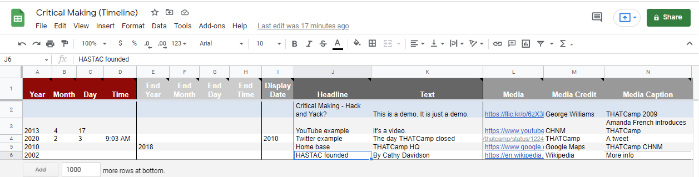

# Making Exercise Twelve: Timeline

As we continue exploring multimodal methods of digital scholarship, we'll be working with a free, open source tool for visualizing interactive timelines: TimelineJS.  At its heart, this library is a front-end for a Google spreadsheet - you can see the underlying logic in action in this example. You won't need to create an account to use [TimelineJS](http://timeline.knightlab.com/), but it does require a Google log-in of some kind to work.

This platform gives us space to continue to explore multimodal making through assemblage: you'll be able to draw in a wide range of content, from Google Maps to video to Wikipedia and Twitter. Try orienting your work around a clear story (for instance, my example begins to document the history of THATCamp's influence on my making, and digital humanities making as a practice.) The stronger your unifying narrative, the more compelling your timeline will be to explore.

## The Timeline Prompt

You'll notice that Timeline.JS lends itself to a more limited, time-cohesive narrative than some of the other scholarly platforms we've employed. To that end, I suggest gathering your materials first, and drafting an outline before you move into the spreadsheet. As you work, plan to:

- **Build approximately fifteen nodes.** These nodes can consist of links, images, tweets, videos, embedded Wikipedia pages, and maps - try to vary the content, and think about your timeline as a pathway for navigating and making new meaning from the linked content. Every node should have an associated year, precise date, or range of dates as appropriate.

- **Write brief descriptions anchoring your story.** Each node has space for additional narrative and explanation. While short test is most effective in the card-based viewing of the timeline itself, think about how the fragments of text fit together to provide a cohesive whole.

- **Explore the style and content options.** Make use of the [spreadsheet guidelines](http://timeline.knightlab.com/docs/using-spreadsheets.html), which cover both clarity in setting titles and eras, as well as options for adding background colors and images to provide more varied visualization. Remember to incorporate all appropriate attributions using the "Media Credit" field, and use the "Media Caption" field to provde alt text for accessibility.

To share the output, you can either link directly in your post from the "Share Your Timeline" link, or embed it in another .html page or site (there are directions for adding it to Scalar below.) As always, include screenshots from your process / spreadsheet as well as the final output in your reflection.

## Walkthrough and Resources

In addition to my overview walkthrough video in the module, there are several resources you can use to support your work with Timeline.JS:

- [TimelineJS Workshop](https://www.youtube.com/watch?v=lKMSR9IUTsA) - This provides another overview of the interface, with a focus on organizing your spreadsheet and structure.
- [Supported Media Types](http://timeline.knightlab.com/docs/media-types.html) - This overview covers the type of media files you can import - note that some work through embed, but most work through direct linking. This is particularly helpful for troubleshooting errors.
- [TimelineJS CSS Selectors](http://timeline.knightlab.com/docs/overriding-styles.html) - For further customization than the defaults offer, it's possible to wrap the output of TimelineJS in your own CSS: this is an advanced option, and not required.

You can additionally bring your timeline into other projects: here's the instructions for [incorporating Timeline.JS in Scalar](https://scalar.usc.edu/works/guide2/timeline-widget).
