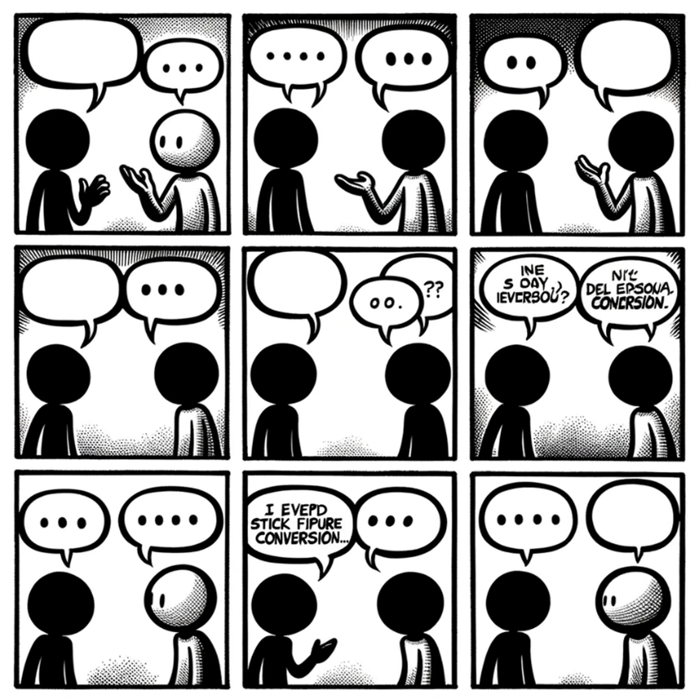
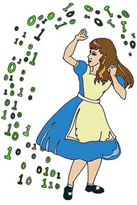
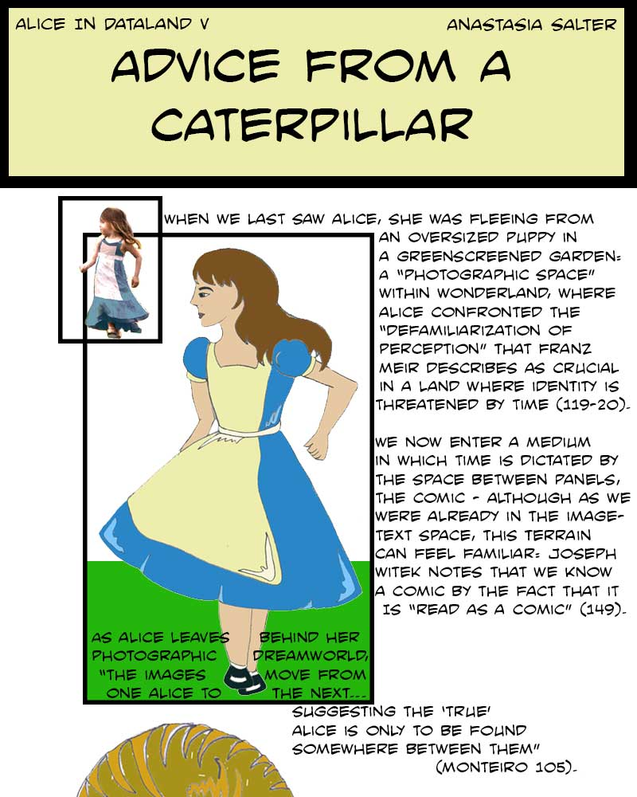

# Making Exercise Two: Comic

Last week, we warmed up for the semester with an exploration of how we might already act as makers, and looked for connections between creative work and our interests as scholars. This week, we're going to think about the limitations of text as a means of scholarly communication by exploring the intersection of image and text--imagetext, or comics. Like our first exercise, this is intended to offer space for playing with materiality and visual intention: we're not worrying about the digital yet, although digital methods and tools might play a role in what you decide to create.

## The Mini-Comic Prompt

This exercise is influenced by a prompt from Nick Sousanis, and draws on his [Making Comics](https://spinweaveandcut.com/making-comics-s2021/) course, which you can explore fully in his online documentation. You can find a substantial collection of resources and inspiration for this particular exercise, the [Mini-Comic, in his course](http://spinweaveandcut.com/making-tools-and-minicomics/). 

Whether you’ve encountered comics online, circulating through platforms such as Instagram and Reddit, or on paper, the basic structures are the same: comics rely upon panels, or framed images, often with text in or below, separated by gaps, or gutters. These structures are recognizable but incredibly flexible: take for instance this example from ChatGPT4 and Dall-E, based on the prompt “create a generic stick figure conversation newspaper comic, with six panels:”

- 

As you make your comic, think about:

- **Unify form and intention.** Note how scholarly comics build an argument, commentary, or critique through the juxtaposition of the visual and the textual. For this pattern, start to think about your communicative intention: will the comic you make critique an object relevant to your research? Connect with a frustration you have about text or its usual assumptions and structures? 
- **Focus on visual exploration, not stressing over your drawing ability.** Make “found” images your base, and draw or annotate within your comfort zone. Think about how images serve a lens for exploring thoughts and expanding metaphors for thinking and criticism: exploring your thoughts through comics can be as simple as annotating on top of the images being remixed, or as complex as building new images out of layering and juxtapositions with your own drawing and commentary.
- **Keep it short and work slowly.** Working physically and remixing images takes time, and once you cut out a section or write something in marker, you’re usually stuck with it! There’s no undo button in physical cut and paste, so this process encourages slowing down and working on a smaller scale.

As before, your reflection for this prompt should consist of approximately five images documenting your process from concept to final work, with a short narrative accompanying it that walks through your thinking. Make connections to the readings and anything that inspired your work, including both examples from the course materials and your own experience with comics outside of this course.

To build a workable foundation, start by folding a page into eight parts: this can easily be converted into a booklet by cutting a line between the two sets of center panels, and thus becomes “book-like” in a way that encourages thinking through sequence and juxtaposition. here's a [simple blueprint for a folded mini-comic](https://dw-wp.com/2010/06/a-simple-minicomic-format/) to get you started. This is a basic way to use the page and keep your scale manageable. However, you can also look at work that uses more experimental formats for ideas: folding the page differently, for instance, can yield new juxtapositions like those at work in Andy Poyiadgi's [origami comic](http://www.ajpoyiadgi.com/comics#/origami-comic/), with images that are disrupted and remixed as you refold. Experimentation is part of the goal: to quote a great guides on making mini-comics, the answer to “How Do I Make Mini-Comics?” is “any way you want” [Spurgeon](https://www.comicsreporter.com/index.php/all_about_comics/all_about/77/).

Next, gather images and combine them on the page: mix your own material with that of relevant archives and your area of interest. Think about how selecting images intentionally and “remixing” them into your comic can create new meanings through juxtapositions. If you’ve ever seen an old-school Xerox zine, that’s a good starting point: using a scanner, or printing out images from the web, can give you small images to work from. As you combine the images, consider trying several approaches to image-making and manipulation. Tracing can be particularly helpful if you want to represent but adapt a specific image: for example, the comic sections of “Alice in Dataland” experiment started as a retracing of a Tenniel illustration recast through a digital lens (shown below). Try “filtering” through your own physical edits and think about the similarities of that work to the digital tools offered by software such as Photoshop.

This type of remix, tracing-to-create, and play is the focus, and the act of creating and manipulating images will open new possibilities for understanding and exploring them in the future. Reading comics by imaginative creators who remix and rethink the page, such as Bryan Talbot’s Alice in Sunderland on the links between Lewis Carroll and the port city of Sunderland (Talbot), can inspire new approaches in your own design.

- 

I used this approach for the cheesy, cartoony illustrations for a full section of that *Kairos* article, [viewable here](https://kairos.technorhetoric.net/20.1/inventio/salter/five/index.html).

- 

Remember, we're cultivating here an approach to the material that we'll bring into the digital as we progress this semester! As with the other approaches we'll be trying, know that some of the students in this course have much more experience with visual design than others, so try to focus on your own work and process rather than comparing yourself to others.
