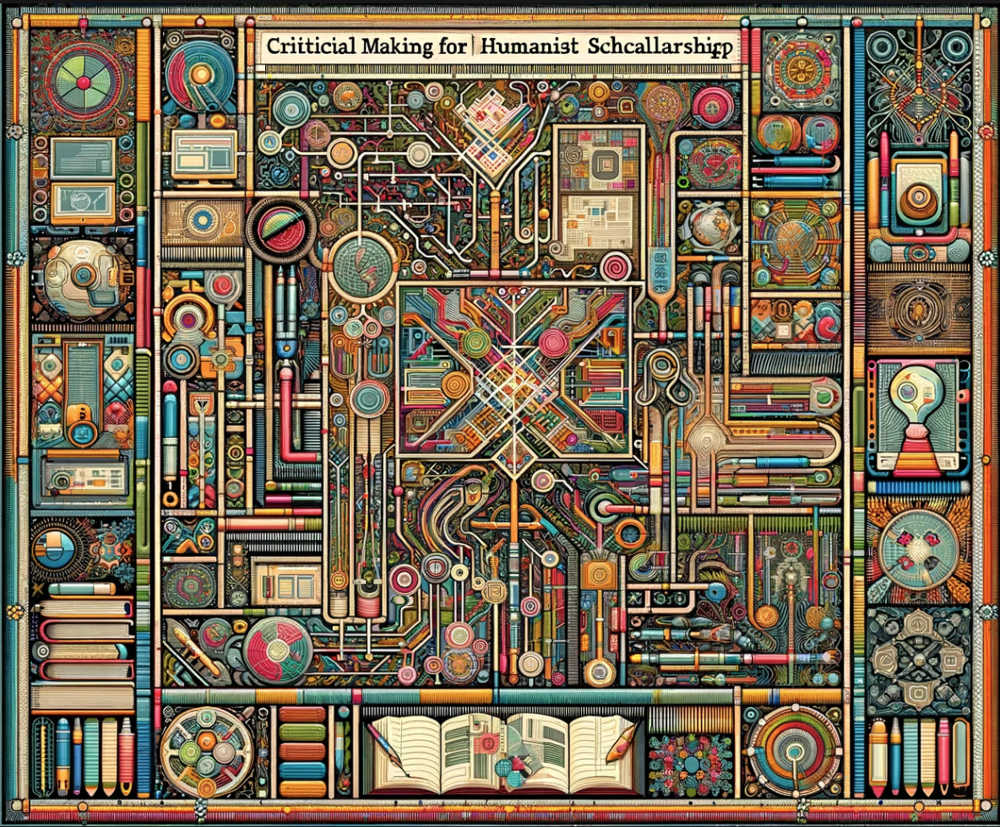

# ENG 6819: Critical Making for Humanist Scholarship

- **Instructor:** Dr. Anastasia Salter
- **Email:** anastasia@ucf.edu
- **Office:** Zoom and TCH 236B; Wednesday 10 - 11:30 AM 
- **Course Meeting:** Asynchronous Online
  
---

## Contents

- [ENG 6819: Critical Making for Humanist Scholarship](#eng-6819-critical-making-for-humanist-scholarship)
  - [Contents](#contents)
  - [Course Description](#course-description)
  - [Course Objectives](#course-objectives)
  - [Materials and Texts](#materials-and-texts)
  - [Evaluation and Grading](#evaluation-and-grading)
  - [Asynchronous Online Course Structure](#asynchronous-online-course-structure)
  - [Weekly Schedule](#weekly-schedule)
    - [Week One: Provocations (Monday, January 8)](#week-one-provocations-monday-january-8)
    - [Week Two: Selfie (Monday, January 15)](#week-two-selfie-monday-january-15)
    - [Week Three: Comic (Monday, January 22)](#week-three-comic-monday-january-22)
    - [Week Four: GIF (Monday, January 29)](#week-four-gif-monday-january-29)
    - [Week Five: Map (Monday, February 5)](#week-five-map-monday-february-5)
    - [Week Six: Hypertext (Monday, February 12)](#week-six-hypertext-monday-february-12)
    - [Week Seven: Game (Monday, February 19)](#week-seven-game-monday-february-19)
    - [Week Eight: Grammar (Monday, February 26)](#week-eight-grammar-monday-february-26)
    - [Week Nine: Analysis (Monday, March 4)](#week-nine-analysis-monday-march-4)
    - [Week Ten: Generation (Monday, March 11)](#week-ten-generation-monday-march-11)
    - [Week Eleven: Spring Break - March 18th - 22](#week-eleven-spring-break---march-18th---22)
    - [Week Twelve: Code (Monday, March 25)](#week-twelve-code-monday-march-25)
    - [Week Thirteen: Narratives (Monday, April 1)](#week-thirteen-narratives-monday-april-1)
    - [Week Fourteen: Combinations (Monday, April 8)](#week-fourteen-combinations-monday-april-8)
    - [Week Fifteen: Futures (Monday, April 15)](#week-fifteen-futures-monday-april-15)
    - [Final Reflection (Due Sunday, April 28)](#final-reflection-due-sunday-april-28)
  - [General Policies](#general-policies)
    - [Academic Integrity](#academic-integrity)
    - [Responses to Academic Dishonesty, Plagiarism, or Cheating](#responses-to-academic-dishonesty-plagiarism-or-cheating)
    - [Course Accessibility Statement](#course-accessibility-statement)
    - [Campus Safety Statement](#campus-safety-statement)
    - [Deployed Active Duty Military Students](#deployed-active-duty-military-students)
    - [Make-Up Assignments for Authorized University Events or Co-curricular Activities](#make-up-assignments-for-authorized-university-events-or-co-curricular-activities)
    - [Religious Observances](#religious-observances)
    - [Title IX Policy](#title-ix-policy)

---

## Course Description

Critical making is a practice of making as scholarship, grounded in the humanities, that interweaves design, function, and theory towards born-digital scholarly practice. Engaging in scholarly communication through digital platforms demands attention to code, software, and hardware. This course emphasizes building a theoretical framework and applied practice in critical making, drawing on digital humanities discourse, intentional design, minimal scripting tools, and multimodal development as part of scholarly communication.

The opportunities critical making presents for humanist work are well-documented. Jentery Sayers’ *Making Things and Drawing Boundaries* (which we'll be drawing upon during the course) collects cutting-edge humanist work from across the field, and in doing so points to the important interventions that critical making in the digital humanities can offer in how and what we know about technology as “not made from scratch but in media res; not transparent platforms but patchworks of memory and practice." However, Sayers’ collection is also a reminder of how difficult it is to get started, with participation demanding layered expertise that is constantly changing. The combination of computational and systems thinking required for critical making develops what Michael Mateas describes as procedural literacy: “the ability to read and write processes, to engage procedural representation and aesthetics, to understand the interplay between the culturally‐embedded practices of human meaning‐making and technically‐mediated processes” (Mateas). These skills are of growing interest in transdisciplinary humanities, but still often seen as the domain of STEM programs, and the rhetoric of code and code education remains exclusionary. We will interrogate those assumptions and systems, emphasizing process over product, and building procedural literacy through play and exploration. As we explore computational creativity, we will also engage with the questions emerging from the increased availability and power of generative AI tools.

Each week, plan on following the module for all asynchronous activities. Each module will be divided into three sections:

- **Weekly Readings.** Complete this combination of primary and secondary texts prior to starting the making exercise. The full schedule of required readings is listed in the syllabus, but additional recommended readings will also be provided in each module.
- **Making Exercises.** Each week's making exercise will involve experimenting with a different tool for making: guidance will be provided on configuring and getting started with the tool, and students are encouraged to be inventive and playful.
- **Reflective Discussion.** A weekly online discussion will provide the opportunity to share the process of making: the emphasis is not on "success" or "failure," but on growth, exploration, and experimentation.

---

## Course Objectives

- Explore principles of inclusive design, emphasizing accessible, intersectional, approaches to user-centered making
- Become familiar with open source tools for critical making across born-digital projects, including games, installations, web-driven, critical code studies, and media archaeology approaches
- Develop skills in interface design, working through paper and digital prototyping, and emphasizing both aesthetics and usability
- Identify venues for born-digital scholarship and develop proposals for publication and funding
- Analyze and critique existing born-digital scholarship, learning from methods of scholarly communication in multimodal formats
- Extend existing skills in scripting and web development

---

## Materials and Texts

This course requires a mix of applied and theoretical readings, including some open access materials. The primary texts include:

- Sasha Costanza-Chock, *Design Justice.* [Open Access](https://design-justice.pubpub.org/)
- Nick Sousanis, *Unflattening.* [Unlimited use ebook available through UCF](https://ebookcentral.proquest.com/lib/ucf/detail.action?docID=4404111)
- Thomas S. Mullaney, Benjamin Peters, Mar Hicks and Kavita Philip. *Your Computer is On Fire.* [Unlimited use ebook available through UCF](https://ebookcentral.proquest.com/lib/ucf/detail.action?docID=6479710)
  
In addition, each module includes samples, tutorials, and resources to guide the week's making experiments. Most weeks also include at least one chapter from the draft of *Patterns for Critical Making* (Emily Johnson and Anastasia Salter) - as this book is still in the review process, please don't circulate these early chapters beyond the class.

---

## Evaluation and Grading

| Points  | Assignment Summary | Due Date  |
|---|---|---|
| 6  | **Activity Verification** - Complete the brief survey posted on Webcourses as soon as possible to confirm your enrollment in the course. As this is required by the university, please attend to it as soon as possible at the start of classes. | Friday, January 12  |
| 84  | **Making Exercises** - Weekly discussions will consist of making, sharing, and reflecting on the process of exploring (12 weeks, 7 points each). Students will work from tutorials and try a new form every week, with reflective questions connecting the process of making to the theoretical frameworks and provocations offered by course readings. | Weekly |
| 10 | **Reflection** - During the final exam week, students will complete a written reflective essay on their journey, with particular consideration to next steps and potential future applications of the making mechanisms introduced throughout the semester.  | Sunday, April 28 |

Students can access their grades and feedback at any time using the Grade Book function of Webcourses. All assignments will be submitted through Webcourses. Plan on checking the site at least twice a week for updates and assignment information. Grades are calculated out of 100 following a standard letter scale.

Late work is accepted without penalty for one week after the listed deadline. If circumstances require extension beyond that deadline, please reach out to the instructor immediately. Additionally, here is one extra credit making exercise option available at the end of the semester for those who miss a weeek. Grades will be available through Webcourses and updated weekly.

---

## Asynchronous Online Course Structure

This course uses a fully asynchronous online format, and relies upon students to complete all readings, engage with both course lectures and other online videos, and join in on course discussions. All assignments are due at the close of their listed module, but will be accepted with no penalty through the next listed deadline. Once an assignment closes, late work will not be accepted unless an additional extension has already been approved by the instructor: please reach out early if circumstances will require additional time!

- The course has no synchronous meeting requirements: however, students are encouraged to attend optional events both on-campus and online if possible to build community and skills. Event information will be shared through weekly announcements.
- Office hour assistance is additionally available both through text on Webcourses messages and via Zoom: Zoom is recommended for advanced technical problems, where screen-sharing might be helpful to resolving errors.
- Students will need access to a reliable internet connection and computer to participate in this course. Due to some of the tool installation needs, administrative access to the system is recommended to complete assignments.
- In the event of an emergency or medical challenge, additional flexibility beyond the grading guidelines is available: when anticipated, students should reach out to the instructor as soon as feasible to form a plan or discuss an incomplete if needed.

---

## Weekly Schedule

### Week One: Provocations (Monday, January 8)

- Matt Ratto, "Critical Making: Conceptual and Material Studies in Technology and Social Life." (PDF)
- Jentery Sayers, ["I Don't Know All the Circuitry"](https://dhdebates.gc.cuny.edu/read/untitled-aa1769f2-6c55-485a-81af-ea82cce86966/section/7d8fca82-c6ca-480f-bf17-1df4a2cdb577)
- Bill Endres, ["A Literacy of Building: Making in the Digital Humanities"](https://dhdebates.gc.cuny.edu/read/untitled-aa1769f2-6c55-485a-81af-ea82cce86966/section/2acf33b9-ac0f-4411-8e8f-552bb711e87c#ch04)
- Johnson and Salter, "Provocations for Making"
- **Due: Activity Verification (Friday, January 12)**

### Week Two: Selfie (Monday, January 15)

- *Unflattening* - First Half
- Frank Auerbach, ["Twenty Self-Portraits (Review)"](https://www.theguardian.com/artanddesign/2023/apr/14/frank-auerbach-twenty-self-portraits-review-hazlitt-holland-hibbert-london)
- Piecework Collective, ["Self Portrait"](https://pieceworkcollective.com/2018/)
- Johnson and Salter, "Chapter One: Selfie"
- **Featured Guest: Anne Sullivan**
- **[Making Exercise One: "Selfie"](exercises/one_selfie)**

### Week Three: Comic (Monday, January 22)

- *Unflattening* - Second Half
- Garnet Hertz, "Making Critical Making." (PDF)
- Scott McCloud, ["My Obsession with Chess."](https://scottmccloud.com/1-webcomics/chess/chess.html)
- Jason Helms, [*Rhizcomics*](https://www.digitalrhetoriccollaborative.org/rhizcomics/)
- Johnson and Salter, "Chapter Two: Comic"
- **Featured Guest: Jason Helms**
- **[Making Exercise Two: Comic](exercises/two_comic)**

### Week Four: GIF (Monday, January 29)

- *Your Computer is On Fire* - Introductions
- David Staley, "On the 'Maker Turn' in Digital Humanities." in [*Making Things and Drawing Boundaries*](https://dhdebates.gc.cuny.edu/projects/making-things-and-drawing-boundaries)
- Explore: [*Buzzademia*](http://hyperrhiz.io/hyperrhiz21/)
- Johnson and Salter, "Chapter Three: GIF" 
- **Featured Guest: Lyle Skains**
- **[Making Exercise Three: GIF](exercises/three_gifs)**

### Week Five: Map (Monday, February 5)

- *Your Computer is On Fire* - Part I
- Nesbit and Ayers, ["Visualizing Emancipation."](https://dsl.richmond.edu/emancipation/)
- Crider and Anderson, ["Disney Death Tour"](https://kairos.technorhetoric.net/23.2/topoi/crider-anderson/index.html)
- Johnson and Salter, "Chapter Four: Map"
- **Featured Guest: Claudia Berger**
- **[Making Exercise Four: Map](exercises/four_maps)**

### Week Six: Hypertext (Monday, February 12)

- Laura Okkema, [*Hearing the Voices of the Deserters*](https://stars.library.ucf.edu/etd/6361/)
- Rachel Ponce, [Surviving History: The Fever!](http://theappendix.net/special/the-fever)
- Explore: [*The Digital Review*](https://thedigitalreview.com/)
- Johnson and Salter, "Chapter Five: Hypertext"
- **Featured Guest: Lee Skallerup Bessette**
- **[Making Exercise Five: Hypertext](exercises/five_hypertext)**
  
### Week Seven: Game (Monday, February 19)

- *Your Computer is On Fire* - Part II
- Sabinne Harrer, "Radical Jamming." (PDF)
- cecile richard, [*Endless Scroll*](https://haraiva.itch.io/endless-scroll)
- Explore: [The Bitsy Essay Jam](https://itch.io/jam/the-bitsy-essay-jam/entries)
- Johnson and Salter, "Chapter Six: Game"
- **Featured Guest: Daniel Cox**
- **[Making Exercise Six: Game](exercises/six_game)**

### Week Eight: Grammar (Monday, February 26)

- *Your Computer is On Fire* - Part III
- Mark Sample, ["The Infinite Catalog of Crushed Dreams."](https://fugitivetexts.net/pandemicdreams/)
- Leonardo Flores, ["Genre: Bot:](https://iloveepoetry.org/?p=5427)
- Explore: [NaNoGenMo](https://nanogenmo.github.io/)
- Johnson and Salter, "Chapter Seven: Grammar"
- **Featured Guest: Leonardo Flores**
- **[Making Exercise Seven: Grammar](exercises/seven_generator)**

### Week Nine: Analysis (Monday, March 4)

- *Your Computer is On Fire* - Afterwords
- *Design Justice* - Introduction
- Catherine D'Ignazio and Lauren Klein, "Feminist Data Visualization." (PDF)
- Micki Kaufman, [*Quantifying Kissinger*](https://blog.quantifyingkissinger.com/)
- Johnson and Salter, "Chapter Eight: Analysis"
- **Featured Guest: Sam Blickhan**
- **[Making Exercise Eight: Analysis](exercises/eight_analysis)**

### Week Ten: Generation (Monday, March 11) 

- *Design Justice*: Design Values
- Ian Demsky, ["My Month with Midjourney"](https://electronicbookreview.com/essay/my-month-with-midjourney/)
- Steven Levy, ["Google's NotebookLM Aims to Be the Ultimate Writing Assistant"](https://www.wired.com/story/googles-notebooklm-ai-ultimate-writing-assistant/)
- Explore: [*Kairos Special Issue: Data Visualization*](https://kairos.technorhetoric.net/25.1/index.html)
- Johnson and Salter, "Chapter Nine: Generation"
- **Featured Guest: Paul Shovlin**
- **[Making Exercise Nine: Generation](exercises/nine_generation)**

### Week Eleven: Spring Break - March 18th - 22

### Week Twelve: Code (Monday, March 25)

- *Design Justice*: Design Practices
- Kathryn Holland and Susan Brown, "Project \ Process \ Product: Feminist Dica Pgital Subjectivity in a Shifting Scholarly Field" in [*Bodies of Information*](https://dhdebates.gc.cuny.edu/projects/bodies-of-information)
- Salter and Johnson, "Chapter Ten: Crafting Futures in the Age of AI"
- **Featured Guest: Jessica Parr**
- **[Making Exercise Ten: Visualization](exercises/ten_visualization)**

### Week Thirteen: Narratives (Monday, April 1)

- *Design Justice*: Design Narratives
- Debbie Chachra, "Beyond Making" in [*Making Things and Drawing Boundaries*](https://dhdebates.gc.cuny.edu/projects/making-things-and-drawing-boundaries)
- Explore: [Games made with P5.js](https://itch.io/games/made-with-p5js)
- [*Black Beaches*](https://arij.net/investigations/black-beaches-en/)
- **Featured Guest: Quinn Dombrowski**
- **[Making Exercise Eleven: Narrative](exercises/eleven_narrative)**
  
### Week Fourteen: Combinations (Monday, April 8)

- *Design Justice*: Design Sites
- Natalie Loveless, *How to Make Art at the End of the World* (PDF selection in Canvas)
- Vera Sebert, [*The Book You are Looking For Does Not Exist*](https://the-book-you-are-looking-for-does-not-exist.xyz/)
- Koeser, Doroudian, Budak, Li. "Data Beyond Vision" in [*Startwords* Issue 1](https://startwords.cdh.princeton.edu/)
- **Featured Guest: Caitlin Fisher**
- **[Making Exercise Twelve: GitHub](exercises/twelve_github)**

### Week Fifteen: Futures (Monday, April 15)

- *Design Justice*: Design Pedagogies
- Explore: [*Digital Pedagogy in the Humanities*](https://digitalpedagogy.hcommons.org/)
- Quinn Dombrowski, [*Future Text*](https://quinndombrowski.com/textiles/future-text/)
- Joshua Reinier, [*Z^k: A Zettelkablooey*](https://thedigitalreview.com/issue03/zk/index.html)
- **Featured Guest: PS Berge**
- **[Optional Making Exercise Thirteen: Multimodal](exercises/thirteen_multimodal)**

### Final Reflection (Due Sunday, April 28)

- Submit & complete your [Final Reflection](exercises/reflection.md), as well as any approved late work, by the end of finals week!

---

## General Policies

### Academic Integrity

[The Center for Academic Integrity (CAI)](http://academicintegrity.org/) defines academic integrity as a commitment, even in the face of adversity, to five fundamental values: honesty, trust, fairness, respect, and responsibility. From these values flow principles of behavior that enable academic communities to translate ideals into action.

**UCF Creed:** Integrity, scholarship, community, creativity, and excellence are the core values that guide our conduct, performance, and decisions.

1. Integrity: I will practice and defend academic and personal honesty.
2. Scholarship: I will cherish and honor learning as a fundamental purpose of my membership in the UCF community.
3. Community: I will promote an open and supportive campus environment by respecting the rights and contributions of every individual.
4. Creativity: I will use my talents to enrich the human experience.
5. Excellence: I will strive toward the highest standards of performance in any endeavor I undertake.

Students should familiarize themselves with [UCF’s Rules of Conduct](https://scai.sdes.ucf.edu/student-rules-of-conduct/). According to Section 1, “Academic Misconduct,” students are prohibited from engaging in

1. Unauthorized assistance: Using or attempting to use unauthorized materials, information or study aids in any academic exercise unless specifically authorized by the instructor of record. The unauthorized possession of examination or course-related material also constitutes cheating.
2. Communication to another through written, visual, electronic, or oral means: The presentation of material which has not been studied or learned, but rather was obtained through someone else’s efforts and used as part of an examination, course assignment, or project.
3. Commercial Use of Academic Material: Selling of course material to another person, student, and/or uploading course material to a third-party vendor without authorization or without the express written permission of the university and the instructor. Course materials include but are not limited to class notes, Instructor’s PowerPoints, course syllabi, tests, quizzes, labs, instruction sheets, homework, study guides, handouts, etc.
4. Falsifying or misrepresenting the student’s own academic work.
5. Plagiarism: Using or appropriating another’s work without any indication of the source, thereby attempting to convey the impression that such work is the student’s own.
6. Multiple Submissions: Submitting the same academic work for credit more than once without the express written permission of the instructor.
7. Helping another violate academic behavior standards.
8. Soliciting assistance with academic coursework and/or degree requirements.

### Responses to Academic Dishonesty, Plagiarism, or Cheating

Students should also familiarize themselves with the procedures for academic misconduct in UCF’s student handbook, [The Golden Rule](https://goldenrule.sdes.ucf.edu/). UCF faculty members have a responsibility for students’ education and the value of a UCF degree, and so seek to prevent unethical behavior and respond to academic misconduct when necessary. Penalties for violating rules, policies, and instructions within this course can range from a zero on the exercise to an “F” letter grade in the course. In addition, an Academic Misconduct report could be filed with the Office of Student Conduct, which could lead to disciplinary warning, disciplinary probation, or deferred suspension or separation from the University through suspension, dismissal, or expulsion with the addition of a “Z” designation on one’s transcript.

### Course Accessibility Statement

This course is built with universal design for learning principles in mind: if you encounter challenges with any of the course materials, assignments, platforms, or requirements, please reach out for assistance, and know that additional support is always available regardles of documentation.

Additionally, the University of Central Florida is committed to providing access and inclusion for all persons with disabilities. Students with disabilities who need access to course content due to course design limitations should contact the professor as soon as possible. Students should also connect with [Student Accessibility Services (SAS)](http://sas.sdes.ucf.edu/) (Ferrell Commons 185, sas@ucf.edu, phone 407-823-2371). For students connected with SAS, a Course Accessibility Letter may be created and sent to professors, which informs faculty of potential course access and accommodations that might be necessary and reasonable. Determining reasonable access and accommodations requires consideration of the course design, course learning objectives and the individual academic and course barriers experienced by the student. Further conversation with SAS, faculty and the student may be warranted to ensure an accessible course experience.

### Campus Safety Statement

Emergencies on campus are rare, but if one should arise during class, everyone needs to work together. Students should be aware of their surroundings and familiar with some basic safety and security concepts.

- In case of an emergency, dial 911 for assistance.
- Every UCF classroom contains an emergency procedure guide posted on a wall near the door. Students should make a note of the guide’s physical location and review the [online version](http://emergency.ucf.edu/emergency_guide.html).
- Students should know the evacuation routes from each of their classrooms and have a plan for finding safety in case of an emergency.
- If there is a medical emergency during class, students may need to access a first-aid kit or AED (Automated External Defibrillator). To learn where those are located, see [locations](https://ehs.ucf.edu/automated-external-defibrillator-aed-locations).
- To stay informed about emergency situations, students can sign up to receive UCF text alerts by going to [MyUCF](https://my.ucf.edu) and logging in. Click on “Student Self Service” located on the left side of the screen in the toolbar, scroll down to the blue “Personal Information” heading on the Student Center screen, click on “UCF Alert”, fill out the information, including e-mail address, cell phone number, and cell phone provider, click “Apply” to save the changes, and then click “OK.”
- Students with special needs related to emergency situations should speak with their instructors outside of class.
- To learn about how to manage an active-shooter situation on campus or elsewhere, consider viewing this [video](https://youtu.be/NIKYajEx4pk).

### Deployed Active Duty Military Students

Students who are deployed active duty military and/or National Guard personnel and require accommodation should contact their instructors as soon as possible after the semester begins and/or after they receive notification of deployment to make related arrangements.

### Make-Up Assignments for Authorized University Events or Co-curricular Activities

Students who represent the university in an authorized event or activity (for example, student-athletes) and who are unable to meet a course deadline due to a conflict with that event must provide the instructor with documentation in advance to arrange a make-up. No penalty will be applied. For more information, see the [UCF policy]("https://policies.ucf.edu/documents/4-401.pdf").

### Religious Observances

Students must notify their instructor in advance if they intend to miss class for a religious observance. For more information, see the [UCF policy](http://regulations.ucf.edu/chapter5/documents/5.020ReligiousObservancesFINALJan19.pdf).

### Title IX Policy

Title IX prohibits sex discrimination, including sexual misconduct, sexual violence, sexual harassment, and retaliation. If you or someone you know has been harassed or assaulted, you can find resources available to support the victim, including confidential resources and information concerning reporting options at [Let's Be Clear](https://letsbeclear.ucf.edu) and [CARES](http://cares.sdes.ucf.edu/).
